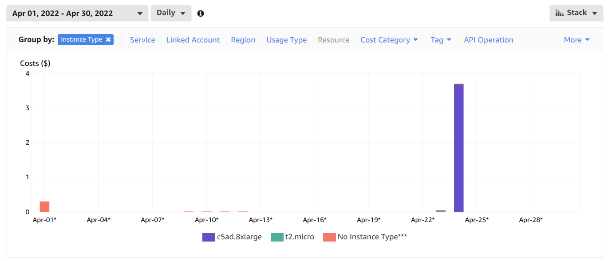
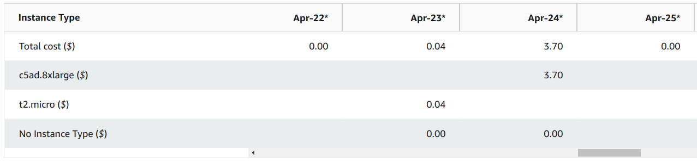
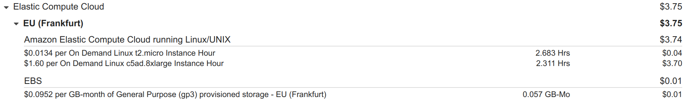
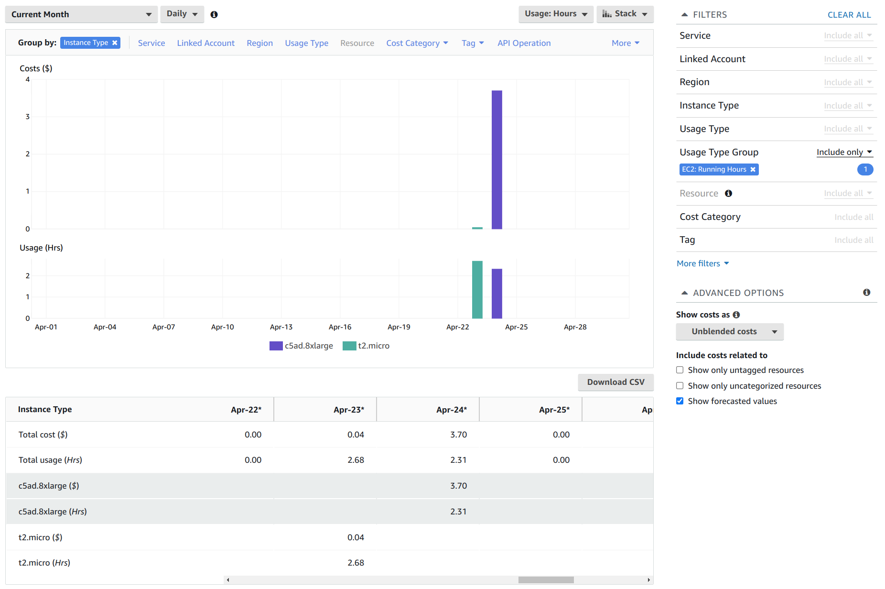

AWS notes
=========

This page contains miscellaneous notes made while using AWS for the first time.

See also:

* [`aws-batch.md`](aws-batch.md)
* [`google-cloud.md`](google-cloud.md)
* [`blender-aws-and-docker.md`](blender-aws-and-docker.md)

Some of the following is digested from the AWS CLI [user guide](https://docs.aws.amazon.com/cli/latest/userguide/getting-started-prereqs.html). I already had an AWS root account (that I'd never used) so, I signed in using it.

Choosing a region
-----------------

I used [cloudping.info](https://www.cloudping.info/) to find the region closest to me - Milan came first followed by Frankfurt and Paris. However, Milan turns out to be one of AWS's smaller regions and has few publicly available resources.

If you look at [AWS regional services](https://aws.amazon.com/about-aws/global-infrastructure/regional-product-services/) and just look at the number of services that are available within each European region, you can see that Ireland comes first, then Frankfurt, London, Paris, Stockholm and last Milan.

So in my AWS account, I set my region to Frankfurt.

Note: if you go to your _Account Settings_, you'll also see that Milan is not enabled by default while Frankfurt and the other European regions are (and cannot be disabled).

Choosing an AMI
---------------

After much googling, I settled on an AMI - the [Amazon Linux 2 AMI with NVIDIA TESLA GPU Driver](https://aws.amazon.com/marketplace/pp/prodview-64e4rx3h733ru).

Some people don't like Amazon Linux, terming it a rolling distro (tho' whether this just applied to the original Amazon Linux and to Amazon Linux 2 is unclear) and that your setup may break with system upgrades. See this Serverfault [answer](https://serverfault.com/a/667144).

But if I have to chose between an up-to-date system (that's hopefully as secure as it can be), with a small risk of occasionally breaking my workflow, vs a more stable but less up-to-date setup, I'll choose the former.

IAM users
---------

As the user guide strongly recommends not working as the root user, I went to the [IAM dashboard](https://us-east-1.console.aws.amazon.com/iamv2/home#/home)

Aside: a bit confusingly the IAM dashboard and some other AWS dashboards have URLs that start with `us-east-1` rather than your default region - `us-east-1` seem also be effectively AWS's _global_ region for things like IAM that aren't separated out by region.

Then I:

* Activated MFA for the root user.
* Deleted the access key associated with the root user (that was set up in 2009 and was shown as having never been used).

### Administrator user

I set up an Administrator user as described in the user guide.

If you go to _Users_, select this user and select the _Security credentials_ tab, you'll find a "Console sign-in link" and can log in as this user (you should do this in a private browsing session as ou only seem to be able to be one user at a time within a given browser session).

I created an access key pair as described in the guide.

The user guide, oddly, didn't suggest it, but I also set up MFA for this user - it's not under _Settings_ but under _Security Credentials_.

AWS CLI
-------

I installed the AWS CLI as described in the user guide.

Note: there are `awscli` packages (a snap and non-snap version) for Ubuntu 20.04 LTS but both appear to be ancient versions of the version 1 CLI rather than recent versions of the version 2 CLI.

```
$ curl https://awscli.amazonaws.com/awscli-exe-linux-x86_64.zip -o awscliv2.zip
$ unzip awscliv2.zip
$ sudo ./aws/install
$ aws --version
aws-cli/2.5.4 Python/3.9.11 Linux/5.13.0-37-generic exe/x86_64.ubuntu.20 prompt/off
```

Then I did the _Quick Setup_ as described in the user guide.

```
$ aws configure
AWS Access Key ID [None]: A...
AWS Secret Access Key [None]: X...
Default region name [None]: eu-central-1
Default output format [None]: json
```

Use the access key ID and secret that you save when creating the Administrator user (_not_ the root user). If you'd saved the key details to a file, you can throw it away now as they're now stored in `~/.aws/credentials`.

Note: the region does not default to anything you set up using the AWS web interface, you need to set it to match your region preferences.

AWS storage
-----------

Storage:

* EBS - instance local storage.
* EFS - container persistent storage, i.e. survives instance death, and is accessible from multiple instances.
* S3 - persistent bucket based storage - most cost efficient and available via a web API.

USD pricing
-----------

AWS prices are always in USD. You can get AWS to convert to your currency when billing or leave it to your card provider.

Looking at some of my past credit card transactions, I see:

* On March 7th, 2022 they charged me CHF 1.034 for 1 Euro (they use a daily fixing that can be found [here](https://fx.swisscard.ch/en/exchange-rates-for-foreign-currencies/) whereas the worst mid-price on that day was CHF 1.009 (according to Yahoo Finance).
* After conversion at that terrible rate they then charge an additional 2.5% on the CHF amount.

So essentially take the worst actual mid-rate, convert and add 5% to get the amount that Swisscard will charge you.

Whereas, if I take the AWS proposed USD rate and the worst mid-rate of the day, it looks closer to 1%. So letting AWS do the conversion looks like the better option.

Using S3
--------

I went to the S3 dashboard (entered "S3" in the search bar), clicked _Create Bucket_ and:

* Called it `e816f2a7-3a16-433a-b16f-9e0483ac5efb`
* Selected the eu-central-1 region.

And left all other defaults as they were.

> Bucket names must be unique across all AWS accounts in all the AWS Regions

Initially, I tried to call by bucket `s3fs-bucket` but the above rule means finding an unused meaningful name is almost impossible to I just generated a random UUID and used that as the name. This seems to be S3 specific, other AWS resources that you create only need to be unique from your perspective.

### Using the CLI to interact with S3

Interacting with S3 buckets via the AWS CLI is simple. First show `ls` all buckets and then interact with one:

```
$ aws s3 ls
$ aws s3 cp foobar.txt s3://e816f2a7-3a16-433a-b16f-9e0483ac5efb
$ aws s3 ls s3://e816f2a7-3a16-433a-b16f-9e0483ac5efb
2022-04-09 17:21:22       1648 foobar.txt
```

### S3 FUSE filesystem

[s3fs-fuse](https://github.com/s3fs-fuse/s3fs-fuse) sounds like a nice way of interacting with S3 but there are some serious things to watch out for:

* You can't update an item in S3 so appending to a file involves deleting and reuploading which may result in significantly more network activity (and costs) than expected.
* Watch out for anything like `locate` and its daemon `updatedb` that scans you filesystem - it will result in downloads (and costly network activity) that you may not expect.

I found the version (V1.86) of `s3fs` on Ubuntu 20.04 LTS could not authenticate itself to AWS.

So I built and installed the latest version:

```
$ git clone https://github.com/s3fs-fuse/s3fs-fuse.git
$ cd s3fs-fuse
$ sudo apt install automake
$ ./autogen.sh
$ sudo apt install libcurl4-openssl-dev
$ sudo apt install libfuse-dev
$ ./configure --prefix=$HOME/s3fs-local
$ make
$ make install
```

Then I could mount and use my bucket like so:

```
$ mkdir s3-bucket
$ ~/s3fs-local/bin/s3fs e816f2a7-3a16-433a-b16f-9e0483ac5efb -o use_cache=$HOME/.s3fs-cache s3-bucket
$ ls s3-bucket/
foobar.txt
```

Note: it uses `~/.aws/credentials` by default but also has its own password file format that you can use instead (and which is used in all the S3FS wiki examples).

If you use `use_cache` then you don't repeatedly download unchanged files if you look at them repeatedly.

But if you copy a file to your local filesystem then be aware that you'll have both that copy and an identical cached copy in the cache directory.

Starting an instance
--------------------

As summarized from StormWind Studios' YouTube tutorial ["Launching Your First AWS Linux EC2 Instance"](https://www.youtube.com/watch?v=kjrKDtxAZpE).

First generate a key-pair (as described [here](https://docs.aws.amazon.com/cli/latest/userguide/cli-services-ec2-keypairs.html)):

```
$ aws ec2 create-key-pair --key-name AwsKeyPair --query 'KeyMaterial' --output text > aws-key-pair.pem
$ chmod go= aws-key-pair.pem
```

The public part of the key is automatically uploaded to AWS (and appears there with the given `key-name`).

AWS commands return a pretty-printed JSON object, the `--query` bit above just selects for the private key part of that response.

You can query AWS for your registered keys:

```
$ aws ec2 describe-key-pairs
```

Now, go to the AWS instance launcher page (as shown in the video linked to above) and set:

* Name: "My tiny server"
* Application and OS Images: latest Amazon Linux AMI that's free tier eligible.
* Instance type: t2.mico
* Key pair: select the `key-name` used above from the dropdown.
* Select _My IP_ from the dropdown to the right of _Allow SSH traffic from_.
* Leave the storage as it is, i.e. 8GiB gp2.

Aside: _gp3_ appears to be cheaper and more performant so, I don't know why _gp2_ is the default, but it doesn't seem to be a big enough deal to be worth changing.

Note: it'll create a security group (called "launch-wizard-1") with your allow-traffic choice - you can also create and manage such groups separately from the instance launch proces.

I left _Advanced_ untouched but interesting options look to be:

* Request spot instance.
* IAM instance profile.
* User data.
* Shutdown behavior.

You can e.g. create an IAM instance profile that allows it to access S3 buckets. User data allows you to specify a script that's run at startup (e.g. you could use a generic AMI and provide a script that defines what work it should do).

Now, press _Launch instance_ then click thru to view running instances and select your instance.

Shutdown behavior
-----------------

_Stop_ vs _Terminate_ - _Terminate_ results in everything being deleted once the machine is shutdown but with _Stop_, your _EBS_ volume survives (and you continue to be billed for it). You can also specify this behavior on a per _EBS_ volume basis (switch to _Advanced_ view above when specifying the volume size).

To see the shutdown behavior, for a running instance, select the instance, click the _Actions_ button, select _Instance settings / Change shutdown behavior_ - there you'll see that it's currently e.g. _Stop_ for my t2.micro instance.

I assumed that the default would be to delete EBD drives, but on doing `sudo shutdown now` the instance entered stopped state and checking the drive showed it was very much still there:


And when I went to terminate the stopped instance, it made clear this would result in deletion of the drive:


Only, once it had been terminated did the drive go away.

Logging in via ssh
------------------

Once the instance was started, I could log in using the private part of the key created above (with `create-key-pair`) and the public IP shown in the instance details:

```
$ ssh -i aws-key-pair.pem ec2-user@3.66.121.224
```

The only users with shells are `root` and `ec2-user`:

```
$ fgrep bash /etc/passwd
root:x:0:0:root:/root:/bin/bash
ec2-user:x:1000:1000:EC2 Default User:/home/ec2-user:/bin/bash
```

If you try to ssh in as root, you see:

```
ssh -i aws-key-pair.pem root@3.66.121.224
Please login as the user "ec2-user" rather than the user "root".
```

The `ec2-user` can `sudo` without a password:

```
$ sudo su -
Last login: Sat Apr 23 15:22:56 UTC 2022 from 31-10-159-229.cgn.dynamic.upc.ch on pts/0
[root@ip-172-31-11-67 ~]#
```

Budget
------

I set up a budget via the _Budget_ link on left-hand side of the _Billing_ dashboard.

I entered a name - "My monthly AWS budget" and a budgeted amount of $10 and left everything else as it was.

Then on the next page, I clicked _Add alert threshold_ and entered 80, leaving _% of budgeted amount_ and _Actual_ as they were.

And entered an email recipient.

I didn't add an automated action that should be taken when the limit is reached.

Costs
-----

You can see your current bill in the _Billing_ dashboard.

You can also dig into your costs using the _Cost Explorer_ dashboard - it's called _Cost Explorer_ in the search bar but the dashboard uses the title _Cost Management_ (with _Cost Explorer_ being a subsection).

In the _Cost Explorer_, you can see charts like this:



The odd cost, with no instance type, shown for April 1st (before I'd even started using any instances), is actually VAT (but this "no instance type" category can also cover data and other things "that are not directly attributable to a specific Instance Type")

Below the chart, you can get more detailed daily numbers:



Under _Bills_, you can see a hourly breakdown aggregated over the billing month:



And In _Cost Explorer_, you can get hourly usage and the related costs by setting the _Usage Type Group_ filter to _EC2: Running Hours_ and setting _Group By_ to _Instance Type_:



If you go to the _Reports_ section, this is actually a pre-defined report - just select _Monthly EC2 running hours costs and usage_.

Rsyc-ing files from an EC2 instace
----------------------------------

I wanted to [`rsync`](https://en.wikipedia.org/wiki/Rsync) files from my EC2 instance while excluding very recent files (that might still be in the process of being written).

For this, GNU relative dates like `5 seconds ago` are interesting (see the relevant coreutils [documentation](https://www.gnu.org/software/coreutils/manual/html_node/Relative-items-in-date-strings.html)).

But in the end I didn't use them. To find all files older than 5 seconds, I did:

```
$ ssh -i aws-key-pair.pem ec2-user@35.158.187.119 'find result -type f -mmin +0.1' -printf '%f\\n' > include.txt
```

Note: initially, I used `-newermt "5 seconds ago"'` with `find` and `--exclude-from` with `rsync` but this results in a race condition - any files created after the `find` is run but before `sync` does its work are not excluded.

Copy those files to local machine:

```
$ rsync -e "ssh -i aws-key-pair.pem" --include-from=include.txt -av ec2-user@35.158.187.119:result/ remote-result
```

The `/` after `...:result` is important - otherwise the directory itself and not just its contents would be copied over. If it's find that `include.txt` is empty, `rsync` doesn't complain.

Shutting down an instance
-------------------------

You can just tell an instance to shut itself down:

```
$ ssh -i aws-key-pair.pem ec2-user@35.158.187.119 'sudo shutdown now'
$ aws ec2 describe-instances --query 'Reservations[*].Instances[*].[InstanceId, State.Name]' --o text
i-063553c4e5e70b6da     terminated
```

It takes a noticeable amount of time for the instance to shut-down, it stays in `running` state for a while, shifts to `shutting-down` and finally `terminated`.

Or you can ask AWS to shut it down for you:

```
$ aws ec2 describe-instances --query 'Reservations[*].Instances[*].InstanceId' --o text
i-063553c4e5e70b6da
$ aws ec2 terminate-instances --instance-ids i-063553c4e5e70b6da
```

Looking up instance features
----------------------------

Looking up processors etc. seems to be easiest using Vantage's [EC2Instances.info](https://instances.vantage.sh/) although, comparing is confusing. Here's how:

* Enter `c5ad.8xlarge` in the _API Name_ search box.
* Click the resulting row and mouse away - it should now be cyan.
* Do the same for `m5dn.8xlarge`.
* Now, clear the _API Name_ search box and click _Compare Selected_.

Using the _Columns_ button, you can e.g. select _Physical Processor_ - you probably want to avoid Amazon's ARM Graviton processors.

For how to breakdown names like `c5ad.8xlarge`, see the packetmischief [instance type cheat sheet](https://www.packetmischief.ca/2018/09/18/aws-abcs-ec2-instance-type-cheat-sheet/).

Instance comparisons
--------------------

AWS are unwilling to grant quotas for more than a G4 or P3 instance, i.e. GPU instances. So, while I wanted to use g4dn.xlarge instances, I started comparing them with other non-GPU instances (for which it's easier to get quotas) to see how they performed.

There are no end of instance types, but I chose instances which required at most 4 vCPUs and had at least 16GiB (except for in the compute category where you need 8 vCPUs before you get 16GiB instances):

| Type        | Name        | vCPUs | Memory | $/hour |
|-------------|-------------|-------|--------|--------|
| Accelerated | g4dn.xlarge | 4     | 16GiB  | $0.66  |
| Compute     | c5d.xlarge  | 4     |  8GiB  | $0.22  |
| Memory      | r5b.large   | 2     | 16GiB  | $0.18  |
| General     | m5.xlarge   | 4     | 16GiB  | $0.23  |

I ran a small render job on each instance type like so:

```
$ AWS_IP=xyz
$ scp -i aws-key-pair.pem blender-setup render-packed.blend ec2-user@$AWS_IP:.
$ ssh -i aws-key-pair.pem ec2-user@$AWS_IP

$ ./blender-setup
$ time blender/blender -b render-packed.blend --python-expr 'import bpy ; bpy.data.scenes["Scene"].cycles.samples = 512' -E CYCLES -s 1 -e 5 -o //result/ -a -- --cycles-device CUDA
```

Note: above I used `CUDA` as the `cycles-device`, for non-GPU instance this had to be changed to `CPU`.

The results were:

| Name          | Time per frame |
|---------------|----------------|
| `g4dn.xlarge` | 58s            |
| `c5d.xlarge`  | 16m 52s        |
| `m5.xlarge`   | 18m 20         |
| `r5b.large`   | 36m 25s        |

The timings for the non-GPU instances are terrible - the `r5b` instance in particular.

Then I tried instance types that required 8 vCPUs:

| Type        | Name         | vCPUs | Memory | $/hour |
|-------------|--------------|-------|--------|--------|
| Accelerated | g4dn.2xlarge | 8     | 32GiB  | $0.94  |
| Accelerated | p3.2xlarge   | 8     | 61GiB  | $3.82  |
| Compute     | c5.2xlarge   | 8     | 16GiB  | $0.39  |
| General     | m5.2xlarge   | 8     | 32GiB  | $0.46  |

The results were:

| Name           | Time per frame |
|----------------|----------------|
| `p3.2xlarge`   | 27s            |
| `g4dn.2xlarge` | 56s            |
| `c5.2xlarge`   | 7m 58s         |
| `m5.2xlarge`   | 9m 13s         |

So the extra memory of the `g4dn.2xlarge` doesn't buy anything.

So the cost per frame works out as follows:

| Name         | $/frame |
|--------------|---------|
| g4dn.xlarge  | $0.011  |
| g4dn.2xlarge | $0.014  |
| p3.2xlarge   | $0.029  |
| c5.2xlarge   | $0.052  |
| c5d.xlarge   | $0.062  |
| m5.xlarge    | $0.070  |
| m5.2xlarge   | $0.071  |
| r5b.large    | $0.109  |

So, you could perhaps use c5.2xlarge instances instead of GPU instances but at a very noticeable time and price cost.

AWS CLI - launching instances
-----------------------------

See the script [`launch-ec2-instance`](launch-ec2-instance) for how to launch instances using the AWS CLI.

To launch an instance, you need a security group - later, I created one via the CLI but initially, I went to the EC2 dashboard  and then to _Security Groups_ and selected one that had been automatically created when I used the web console to start an AMI of the type that I now wanted to start via the command line.

The security group was created in response to these choice:

* That I didn't want to allow inbound HTTP traffic.
* And that I only wanted to allow inbound traffic from my IPv4 address at the time (note my IP address seems to be fairly stable but could change with time).

By default, all outbound traffic is allowed - I looked, and it turns out that restricting it to e.g. just S3 isn't trivial.

Ideally, you want to get to a point where your setup where no inbound rule is needed at all.

Other cloud platforms
---------------------

The unwillingness of AWS to let new customers launch anything more than a single [V100 instance](https://aws.amazon.com/ec2/instance-types/p3/) doesn't make it very attractive for GPU workloads.

The A100 is the next generation after the V100 and both GCP and Azure have them available:

* GCP - [GPU pricing](https://cloud.google.com/compute/gpus-pricing) - at the moment only europe-west4 (Netherlands) has A100 units.
* Azure [pricing](https://azure.microsoft.com/en-us/pricing/details/virtual-machines/linux/#pricing) - select category _GPU_ and VM series _NCA100v4-series_ - at the moment only _West Europe_ has A100 units.

See [`google-cloud.md`](google-cloud.md) for my Google Cloud notes. In the end, it seems other platforms are just as cautious in granting access GPU-instances.

Note: there's also the cheaper A10G which is the successor to the cards used on the T4 cards used on AWS's G4 instances. However, at the moment the relevant G5 instances are only available in Europe in the eu-west-1 (Ireland) region.