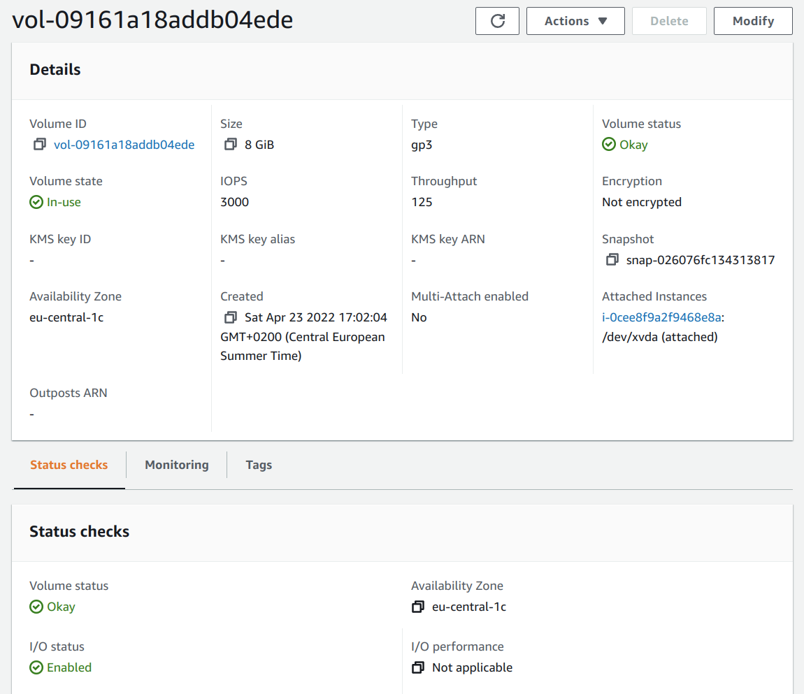
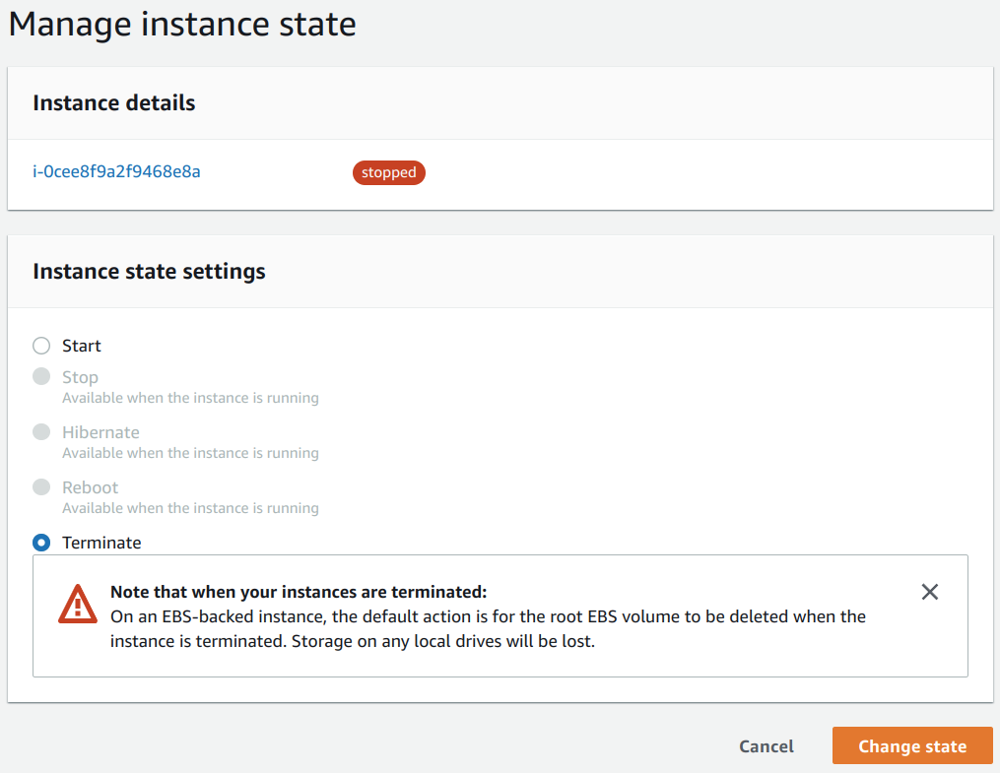
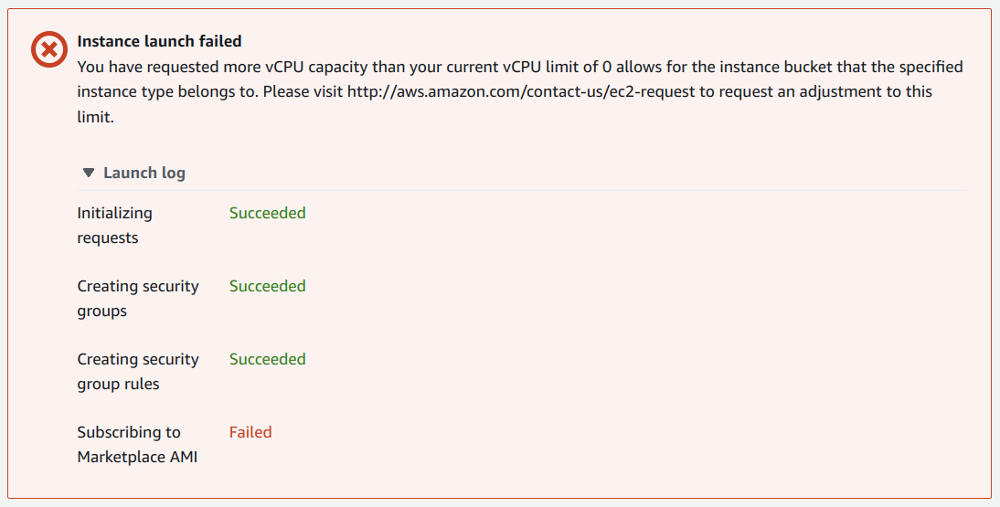
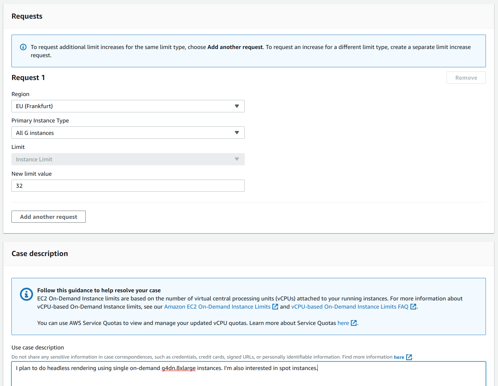
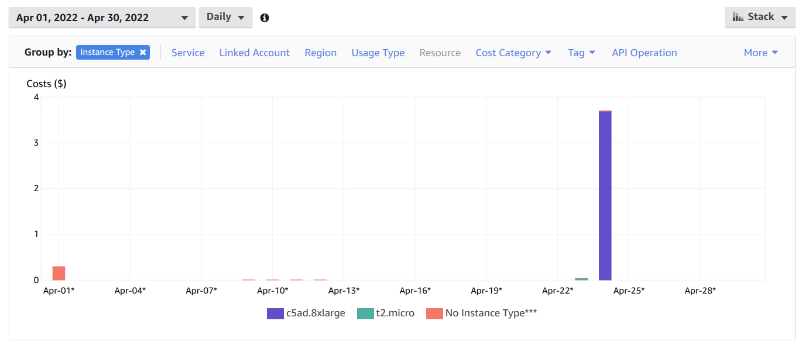
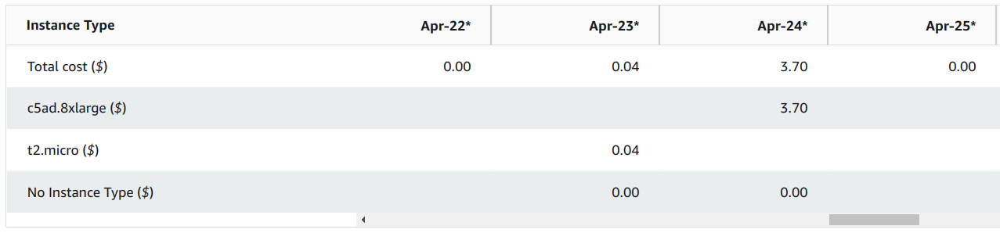
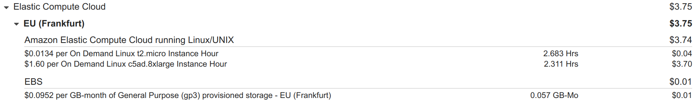
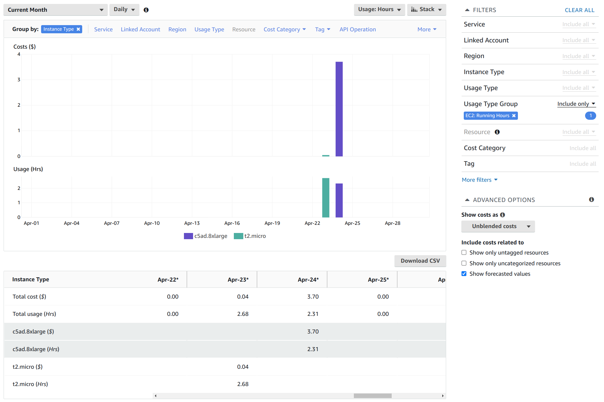

AWS notes
=========

Digested from the the AWS CLI [user guide](https://docs.aws.amazon.com/cli/latest/userguide/getting-started-prereqs.html).

I already had an AWS root account (the same as my Amazon account) so signed in using it.

I used [cloudping.info](https://www.cloudping.info/) to find the region closest to me - Milan came first followed by Frankfurt and Paris.

So Milan would seem the obvious choice, but...

After much googling, I settled on an AMI - the [Amazon Linux 2 AMI with NVIDIA TESLA GPU Driver](https://aws.amazon.com/marketplace/pp/prodview-64e4rx3h733ru).

---

Some people don't like it, terming it a rolling distro (tho' whether this just applied to the original Amazon Linix and to Amazon Linux 2 is unclear) and that your setup may break with system upgrades.

See this Serverfault [answer](https://serverfault.com/a/667144).

But if I have to chose between a secure system that's always as secure as it can be, at the small risk of breaking my workflow occassionally, vs a more stable but less secure setup, I'll chose the former.

---

If you follow the Amazon Linux 2 AMI with NVIDIA TESLA GPU Driver link above you can find per-region pricing and Milan is not listed.

So back to my AWS account - I set my region to Frankfurt.

If you look at [AWS regional services](https://aws.amazon.com/about-aws/global-infrastructure/regional-product-services/) you can see that ranked by number of available services, Frankfurt comes first, Paris second and Milan third (within Europe, Ireland comes tops).

Note: if you to your _Account Settings_, you'll also see that Milan is not enabled by default while Frankfurt and the other European regions are (and in fact cannot be disabled).

---

As the user guide strongly recommends not working as the root user, I went to the [IAM dashboard](https://us-east-1.console.aws.amazon.com/iamv2/home#/home)

Aside: a bit confusingly the IAM dashboard and other AWS consoles have URLs that start with `us-east-1` rather than your default region - `us-east-1` seem also be effectively AWS's _global_ region for things like IAM that aren't separated out by region.

Then I:

* Activated MFA for the root user.
* Deleted the access key associated with the root user (this was set up in 2009 and was shown as never having been used).

---

I setup an Adminstrator user as described in the user guide.

If you go to Users, select this user and select the _Security credentials_ tab, you'll find a "Console sign-in link" and can log in as this user (things get a bit schizophrenic then but really you only seem to be able to be one user at a time).

I created an access key pair as described in the guide.

The user guide, oddly, didn't suggest it but I also set up MFA for this user - it's not under _Settings_ but under _Security Credentials_.

---

I installed the AWS CLI as described in the user guide.

Note: there are `awscli` packages (a snap and non-snap version) for Ubuntu 20.04 LTS but both appear to be ancient versions of the version 1 CLI rather than recent versions of the version 2 CLI.

```
$ curl https://awscli.amazonaws.com/awscli-exe-linux-x86_64.zip -o awscliv2.zip
$ unzip awscliv2.zip
$ sudo ./aws/install
$ aws --version
aws-cli/2.5.4 Python/3.9.11 Linux/5.13.0-37-generic exe/x86_64.ubuntu.20 prompt/off
```

---

Then I did the _Quick Setup_ as described in the user guide.

```
$ aws configure
AWS Access Key ID [None]: A...
AWS Secret Access Key [None]: X...
Default region name [None]: eu-central-1
Default output format [None]: json
```

If you saved the key details to a file, you can throw that away now as they're now stored in `~/.aws/credentials`.

---

Storage:

* EBS - instance local storage.
* EFS - container persistent storage, i.e. survives instance death, and is accessible from multiple instances.
* S3 - persistent bucket based storage - most cost efficient and available via a web API.

---

AWS prices are always in USD. You can get AWS to convert to your currency when billing or leave it to your card provider.

Looking at some of my past credit card transactions, I see:

* On March 7th, 2022 they charged me CHF 1.034 for 1 Euro (they use a daily fixing that can be found [here](https://fx.swisscard.ch/en/exchange-rates-for-foreign-currencies/) whereas the worst mid-price on that day was CHF 1.009 (according to Yahoo Finance).
* After conversion at that terrible rate they then charge an additional 2.5% on the CHF amount.

So essentially take the worst mid-rate, convert and add 5% to get the amount Swisscard will charge you.

Whereas if I take the AWS proposed USD rate and the worst mid-rate of the day, it looks closer to 1%. So letting AWS do the conversion looks like the better option.

---

Setup AWS role to allow EC2 instance to access S3:

* https://www.youtube.com/watch?v=0zq9eC1M5Dk

Mount S3 as filesystem:

* https://github.com/s3fs-fuse/s3fs-fuse

---

I went to the S3 dashboard (entered "S3" in the search bar), clicked _Create Bucket_ and:

* Called it `e816f2a7-3a16-433a-b16f-9e0483ac5efb`
* Selected the eu-central-1 region.

And left all other defaults as they were.

> Bucket names must be unique across all AWS accounts in all the AWS Regions

Initially, I tried to call by bucket `s3fs-bucket` but the above rule means finding an unused meaningful name is almost impossible to I just generated and used a random UUID.

---

Iteracting with S3 buckets via the AWS CLI is simple. First show `ls` all buckets and then interact with one:

```
$ aws s3 ls
$ aws s3 cp foobar.txt s3://e816f2a7-3a16-433a-b16f-9e0483ac5efb
$ aws s3 ls s3://e816f2a7-3a16-433a-b16f-9e0483ac5efb
2022-04-09 17:21:22       1648 foobar.txt
```

[s3fs-fuse](https://github.com/s3fs-fuse/s3fs-fuse) sounds like a nice way of interacting with S3 but there are some serious things to watch out for:

* You can't update an item in S3 so appending to a file involves deleting and reuploading which may result in significantly more network activity (and costs) than expected.
* Watch out for anything like `locate` and its daemon `updatedb` that scans you filesystem - it will result in downloads (and costly network activity) that you may not expect.

I found the version (V1.86) of `s3fs` on Ubuntu 20.04 LTS could not authenticate itself to AWS.

So I built and installed the latest version:

```
$ git clone https://github.com/s3fs-fuse/s3fs-fuse.git
$ cd s3fs-fuse
$ sudo apt install automake
$ ./autogen.sh
$ sudo apt install libcurl4-openssl-dev
$ sudo apt install libfuse-dev
$ ./configure --prefix=$HOME/s3fs-local
$ make
$ make install
```

Then I could use it:

```
$ mkdir s3-bucket
$ ~/s3fs-local/bin/s3fs e816f2a7-3a16-433a-b16f-9e0483ac5efb -o use_cache=$HOME/.s3fs-cache s3-bucket
$ ls s3-bucket/
foobar.txt
```

Note: it uses `~/.aws/credentials` by default but also has its own password file format that you can use instead (and which is used in all the S3FS wiki examples).

If you use `use_cache` then you don't repeatedly download unchanged files if you look at them repeatedly.

But if you copy a file to your local filesystem then be aware that you'll have both that copy and an identical cached copy in the cache directory.

---

Starting an instance
--------------------

Start an instance: <https://www.youtube.com/watch?v=kjrKDtxAZpE>

First generate a key-pair (as described [here](https://docs.aws.amazon.com/cli/latest/userguide/cli-services-ec2-keypairs.html)):

```
$ aws ec2 create-key-pair --key-name AwsKeyPair --query 'KeyMaterial' --output text > aws-key-pair.pem
$ chmod go= aws-key-pair.pem
```

The public part of the key is automatically uploaded to AWS (and appears there with the given `key-name`).

All (or most?) AWS commands return a pretty-printed JSON object, the `--query` bit above just selects for the private key part of the response.

You can query AWS for your registered keys:

```
$ aws ec2 describe-key-pairs
```

Now, go to the AWS instance launcher page (as shown in the video linked to above) and:

* Name: "My tiny server"
* Application and OS Images: latest Amazon Linux AMI that's free tier eligible.
* Instance type: t2.mico
* Key pair: select the `key-name` used above from the dropdown.
* Select _My IP_ from the dropdown to the right of _Allow SSH traffic from_.
* I left the storage at 8GiB but switched from the default _gp2_ to _gp3_ - _gp3_ appears to be cheaper and more performant so I don't know why _gp2_ is the default.

Note: it'll create a security group (called "launch-wizard-1") with your allow-traffic choice - you can also create and manage such groups separately from the instance launch proces.

I left _Advanced_ untouched but interesting options look to be:

* Request spot instance.
* IAM instance profile.
* User data.

You can e.g. create an IAM instance profile that allows it to access S3 buckets. User data allows you to specify a script that's run at startup - this _might_ be interesting (e.g. you could use a generic AMI, not give it a public IP but provide a script that defines what it should do and e.g. save its work to an S3 bucket).

Note: _Stop_ vs _Terminate_ - _Terminate_ results in everything being deleted once the machine is shutdown but with _Stop_, your _EBS_ volume survives (and you are billed for it). You can also specify this behavior on a per _EBS_ volume basis (switch to _Advanced_ view above when specifying the volume size).

Now, press _Launch instance_ then click thru to view running instances and select your instance.

Note: to see the shutdown behavior, that the instance defaulted to, select the instance, click the _Actions_ button, select _Instance settings / Change shutdown behavior_ - there you'll see that it's currently e.g. _Stop_ for my t2.micro instance. But as I didn't actively mark that any of my storage should survive stop, this should still be OK - i.e. I won't be billed for EBS storage after the instance is shutdown.

---

**Update:** on doing `sudo shutdown now` the instance entered stopped state and checking the drive showed it was very much still there:



And when I went to terminate the instance, it made clear this would result in deletion of the drive:



Only, once it had been terminated did the drive go away.

---

Now, using the private part of the key created above and the public IP shown in the instance details, I can log in:

```
$ ssh -i aws-key-pair.pem ec2-user@3.66.121.224
```

The only users with shells are `root` and `ec2-user`:

```
$ fgrep bash /etc/passwd
root:x:0:0:root:/root:/bin/bash
ec2-user:x:1000:1000:EC2 Default User:/home/ec2-user:/bin/bash
```

If you try to ssh in as root, you see:

```
ssh -i aws-key-pair.pem root@3.66.121.224
Please login as the user "ec2-user" rather than the user "root".
```

The `ec2-user` can `sudo` without a password:

```
$ sudo head /var/log/messages 
Apr 23 15:02:22 ip-172-31-11-67 journal: Runtime journal is using 6.0M (max allowed 48.2M, trying to leave 72.3M free of 476.2M available → current limit 48.2M).
...
$ sudo su -
Last login: Sat Apr 23 15:22:56 UTC 2022 from 31-10-159-229.cgn.dynamic.upc.ch on pts/0
[root@ip-172-31-11-67 ~]#
```

Running Blender in Docker
-------------------------

Interestingly, the New York Times [R&D department](https://rd.nytimes.com/) maintains the most used Blender docker containers (everything else is abandon-ware). You can find the scripts involved [here](https://github.com/nytimes/rd-blender-docker) on GitHub.

And here e.g. is the [Dockerfile](https://github.com/nytimes/rd-blender-docker/blob/master/dist/3.1-gpu-ubuntu18.04/Dockerfile) for Blender 3.1. They use [nvidia/cudagl](https://hub.docker.com/r/nvidia/cudagl) as the base image - but for some reason use a version that's built on-top of Ubuntu 18.04 rather than the latest 20.04 based image.

Blender on Amazon Linux 2 AMI
-----------------------------

Oddly, Eevee can't run without a display (but Cycle can). You can set up a virtual display but easier is to just use X forwarding when ssh-ing in from a machine that does have X.

X forwarding requires `xauth` (see the answers to this Unix & Linux SE [question](https://unix.stackexchange.com/q/12755/111626)).

However, even with a X-forwarding Eevee failed like this:

```
$ $ ./blender/blender -b input.blend -E BLENDER_EEVEE -o //result/ -f 1
Blender 3.1.2 (hash cc66d1020c3b built 2022-03-31 23:36:08)
/run/user/1000/gvfs/ non-existent directory
Read blend: /home/ec2-user/input.blend
Error! GLX_ARB_create_context not available.
```

However, from googling, this may be due to the lack of any kind of local graphics card.

For more details, see this [post](https://devtalk.blender.org/t/blender-2-8-unable-to-open-a-display-by-the-rendering-on-the-background-eevee) from 2020 (things don't seem to have changed since).

---

Running Cycle worked fine without any X-forwarding magic etc. but on a t2.micro instance, it always got killed before completing no matter how few sample were specified:

```
$ ./blender/blender -b input.blend --python-expr 'import bpy ; bpy.data.scenes["Scene"].cycles.samples = 4' -E CYCLES -o //result/ -f 1
```

Note: you can't specify samples via a direct command line argument, hence the small bit of Python above.

Full setup:

```
$ version=3.1.2
$ url=$(curl -s -D- -L https://www.blender.org/download/release/Blender${version%.*}/blender-$version-linux-x64.tar.xz -o /dev/null | sed -n 's/^refresh:.*url=\(.*\.xz\).*/\1/p')
$ curl -sL $url -o blender.tar.xz
$ mkdir blender
$ time tar -xf blender.tar.xz --strip-components=1 -C blender
$ sudo yum -y install libX11
$ sudo yum -y install libXi
$ sudo yum -y install libXxf86vm
$ sudo yum -y install libXfixes
$ sudo yum -y install libXrender
$ sudo yum -y install libGL
$ sudo yum -y install xauth
$ ./blender/blender -b input.blend -E BLENDER_EEVEE -o //result/ -f 1
$ ./blender/blender -b input.blend -E CYCLES -o //result/ -f 1
$ ./blender/blender -b input.blend --python-expr 'import bpy ; bpy.data.scenes["Scene"].cycles.samples = 4' -E CYCLES -o //result/ -f 1
```

SEE BELOW FOR MINIMIZED `yum` SEQUENCE.

Interestingly, if I try locally, I get better performance for `OPTIX` that `OPTIX+CPU`:

```
$ time .../blender -b input.blend --python-expr 'import bpy ; bpy.data.scenes["Scene"].cycles.samples = 16' -E CYCLES -o //result/ -a -- --cycles-device OPTIX
```

_Possibly_, it varies by job.

**Confirm** there are no missing file:

```
$ ./blender/blender -b input.blend --python-expr 'import bpy ; bpy.ops.file.report_missing_files()'
...
Warning: Path '/home/blender-projects/car-texture.png' not found
Warning: Path '/home/blender-projects/tintin-texture.png' not found
Warning: Path '/home/blender-projects/car-texture.png' not found
Warning: Path '/home/blender-projects/tintin-texture.png' not found
...
```

To ensure everything is packed:

```
$ cp race-track-5.blend render-packed.blend
$ .../blender -b render-packed.blend --python-expr 'import bpy ; bpy.ops.file.pack_all(); bpy.ops.wm.save_mainfile()'
```

First pass:

```
$ sudo yum -y install libX11
$ sudo yum -y install libXi
$ sudo yum -y install libXxf86vm
$ sudo yum -y install libXfixes
$ sudo yum -y install libXrender
$ sudo yum -y install libGL
$ sudo yum -y install xauth
```

Second pass:

```
$ sudo yum -y install libGL
$ sudo yum -y install libXrender
$ sudo yum -y install libXi
```

---

The suitable instance types for use with "Amazon Linux 2 AMI with NVIDIA TESLA GPU Driver" can be seen on its AWS marketplace [page](https://aws.amazon.com/marketplace/pp/prodview-64e4rx3h733ru).

They recommend the `p3.2xlarge` (at $3 per hour). The page "[Choosing the right GPU for deep learning on AWS](https://towardsdatascience.com/choosing-the-right-gpu-for-deep-learning-on-aws-d69c157d8c86)" gives a good overview of the different relevant instance types.

I chose the `g4dn.xlarge` (at $0.7 per hour) suggested by the "choosing" page.

You can find more information on AWS's instance type [page](https://www.amazonaws.cn/en/ec2/instance-types/). In the _Accelerated Computing Instances_ section, you've got 3 types - `p3`, `g4dn` and `inf1` - the `inf1` instances use a custom Amazon GPU while `g4dn` and `p3` use Nvidia cards (for more information see [here](https://aws.amazon.com/ec2/instance-types/g4/) for G4 and [here](https://aws.amazon.com/ec2/instance-types/p3/) for P3). The impression, I get is that you should stick with single GPU `g4dn` instances but if you need even more power and multiple GPUs you should switch to `p3`.

Note: the 32vCPU `g4dn.8xlarge` is still single GPU, then prices jump noticeably to the 48 vCPU / 4 GPU `g4dn.12xlarge` and further to the `g4dn.16xlarge` (which is back down to single GPU but has 64 vCPUs).

You can find the price for any instance [here](https://aws.amazon.com/ec2/pricing/on-demand/)

* Name: "Blender server"
* Application and OS Images: I entered "Amazon Linux 2 AMI with NVIDIA TESLA GPU Driver" in the search field and selected the vanilla Amazon version.
* Instance type: g4dn.xlarge
* Key pair: select the `key-name` used above from the dropdown.
* Select _My IP_ from the dropdown to the right of _Allow SSH traffic from_.
* **Important:** I deselected _Allow HTTP traffic from the internet_ which was selected by default.
* I switched the root volume to gp3 but left it at 8GiB. You also get a second volume of 125GiB of ephemeral storage.
* Under _Advanced_ I set _Shutdown behavior_ to _Terminate_.

TODO: if you use the AWS CLI `terminate-instance` command then setting shutdown behavior isn't so important (tho' it is nice to also be able to trigger shutdown from the instance and know for definite what will happen).

It refused to let me launch such an instance:



You have to go to the [limits calculator](https://eu-central-1.console.aws.amazon.com/ec2/v2/home?region=eu-central-1#LimitsCalculator:) and search for the largest instance, you're likely to want to run, e.g. the `g4dn.8xlarge`. Then click the _Request on-demand limit increase_ link (and/or the spot one):



I requested the limit for a `g4dn.8xlarge` even tho' I only initially planned to use the smaller `g4dn.xlarge`.

I want a `g4dn` or `p3` but the biggest general purpose or compute optimized instances I can get initially are:

* `c5ad.8xlarge` - compute optimized with 32 vCPUs and 64GiB RAM.
* `m5dn.8xlarge` - general purpose with 32 vCPUs and 128GiB RAM.

In terms of CPU power, the AMD EPYC 7R32 of the `c5ad.8xlarge` appears to deliver twice the bang of the Xeon 8259CL found in the `m5dn.8xlarge` (each thread is similarly powerful but the EPYC has twice as many).

Using the `c5ad.8xlarge`, I got render times that were about twice as slow as using my Nvidia RTX 2060 locally.

---

Looking up processors etc. seems to be easiest using <https://instances.vantage.sh/> although comparing is confusing, here's how:

* Enter `c5ad.8xlarge` in the _API Name_ search box.
* Click the resulting row and mouse away - it should now be cyan.
* Do the same for `m5dn.8xlarge`.
* Now, clear the _API Name_ seach box and click _Compare Selected_.

Using the _Columns_ button, you can e.g. select _Physical Processor_ - you probably want to avoid Amazon's ARM Graviton processors.

For how to breakdown names like `c5ad.8xlarge`, see <https://www.packetmischief.ca/2018/09/18/aws-abcs-ec2-instance-type-cheat-sheet/>

For a table breaking down the different types, see <https://www.parkmycloud.com/blog/ec2-instance-types/>

Budget
------

I set up a budget via the _Budget_ link on left-hand side of the _Billing_ dashboard.

I entered a name - "My monthly AWS budget" and a budgeted amount of $10 and left everything else as it was.

Then on the next page, I clicked _Add alert threshold_ and entered 80, leaving _% of budgeted amount_ and _Actual_ as they were.

And entered an email recipient.

I didn't add an automated action that should be taken when the limit is reached.

Costs
-----

You can see your current bill in the _Billing_ dashboard.

You can also dig into your costs using the _Cost Explorer_ dashboard - it's called _Cost Explorer_ in the search bar but the dashboard uses the title _Cost Management_ (with _Cost Explorer_ being a subsection).

In the _Cost Explorer_, you can see charts like this:



The odd cost, with no instance type, shown for April 1st (before I'd even started using any instances), is actually VAT (but this "no instance type" category can also cover data and other things "that are not directly attributable to a specific Instance Type")

Below the chart, you can get more detailed daily numbers:



But I wish you could get these figures expressed in hour-of-usage or GiBs-of-data and not just dollars.

Under _Bills_, you can see a hourly breakdown but aggregated over the billing month:



**Update:** actually, you can get hourly usage and the related costs in the _Cost Explorer_ by setting the _Usage Type Group_ filter to _EC2: Running Hours_ and setting _Group By_ to _Instance Type_:



If you go to the _Reports_ section, this is actually a pre-defined report - just select _Monthly EC2 running hours costs and usage_.

---

GNU relative dates like `5 seconds ago` are interesting - see <https://www.gnu.org/software/coreutils/manual/html_node/Relative-items-in-date-strings.html>

---

Find all files older than 5 seconds:

```
$ ssh -i aws-key-pair.pem ec2-user@35.158.187.119 'find result -type f -mmin +0.1' -printf '%f\\n' > include.txt
```

Note: initially, I used `-newermt "5 seconds ago"'` with `find` and `--exclude-from` with `rsync` but this results in a race condition - any files created after the `find` is run but before `sync` does its work are not excluded.

Copy those files to local machine:

```
$ rsync -e "ssh -i aws-key-pair.pem" --include-from=include.txt -av ec2-user@35.158.187.119:result/ remote-result
```

The `/` after `...:result` is important - otherwise the directory itself and not just its contents would be copied over.

It's find if `exclude.txt` is empty - `rsync` doesn't complain.

Shutting down an instance
-------------------------

```
$ ssh -i aws-key-pair.pem ec2-user@35.158.187.119 'sudo shutdown now'
$ aws ec2 describe-instances --query 'Reservations[*].Instances[*].[InstanceId, State.Name]' --o text
i-063553c4e5e70b6da     terminated
```

It takes a noticeable amount of time for the instance to shut-down, it stays in `running` state for a while, shifts to `shutting-down` and finally `terminated`.

TODO: next time find the instance with `describe-instances` and shut it down with:

```
$ aws ec2 terminate-instances --instance-ids i-123
```

p3.2xlarge first use
--------------------

Copied over `.blend` file:

    $ scp -i aws-key-pair.pem render-packed.blend ec2-user@18.156.136.92:input.blend

Surprisingly, not all the latest security updates were applied:

    $ sudo yum update

Then tried to render a frame using OPTIX:

    $ version=3.1.2
    $ url=$(curl -s -D- -L https://www.blender.org/download/release/Blender${version%.*}/blender-$version-linux-x64.tar.xz -o /dev/null | sed -n 's/^refresh:.*url=\(.*\.xz\).*/\1/p')
    $ curl -sL $url -o blender.tar.xz
    $ mkdir blender
    $ time tar -xf blender.tar.xz --strip-components=1 -C blender
    $ time blender/blender -b input.blend --python-expr 'import bpy ; bpy.data.scenes["Scene"].cycles.samples = 16' -E CYCLES -o //result/ -f 1 -- --cycles-device OPTIX

It turned out the driver version (450) was too old to support OPTIX.

    $ nvidia-smi
    Sat May  7 10:15:49 2022    
    +-----------------------------------------------------------------------------+
    | NVIDIA-SMI 450.119.01   Driver Version: 450.119.01   CUDA Version: 11.0     |
    |-------------------------------+----------------------+----------------------+
    | GPU  Name        Persistence-M| Bus-Id        Disp.A | Volatile Uncorr. ECC |
    | Fan  Temp  Perf  Pwr:Usage/Cap|         Memory-Usage | GPU-Util  Compute M. |
    |                               |                      |               MIG M. |
    |===============================+======================+======================|
    |   0  Tesla V100-SXM2...  On   | 00000000:00:1E.0 Off |                    0 |
    | N/A   55C    P0    52W / 300W |      0MiB / 16160MiB |      0%      Default |
    |                               |                      |                  N/A |
    +-------------------------------+----------------------+----------------------+
                                                                                
    +-----------------------------------------------------------------------------+
    | Processes:                                                                  |
    |  GPU   GI   CI        PID   Type   Process name                  GPU Memory |
    |        ID   ID                                                   Usage      |
    |=============================================================================|
    |  No running processes found                                                 |
    +-----------------------------------------------------------------------------+

It could run with `CUDA` but then the V100 performance was no better than my RTX 2060:

    $ time blender/blender -b input.blend --python-expr 'import bpy ; bpy.data.scenes["Scene"].cycles.samples = 512' -E CYCLES -o //result/ -a -- --cycles-device CUDA

I tried upgrading the driver but I presume you need to add a new repo, the default one just contained the 450 version:

    $ sudo yum erase nvidia cuda
    $ yum check-update
    Loaded plugins: dkms-build-requires, extras_suggestions, langpacks, priorities, update-motd
    [ec2-user@ip-172-31-38-117 ~]$ sudo yum install nvidia cuda
    Loaded plugins: dkms-build-requires, extras_suggestions, langpacks, priorities, update-motd
    Resolving Dependencies
    --> Running transaction check
    ---> Package cuda.x86_64 0:9.2.88-0.amzn2 will be installed
    ---> Package nvidia.x86_64 1:450.119.01-0.amzn2 will be installed
    ...

Nvidia drivers
--------------

How to install the Nvidia drivers on Linux - <https://docs.nvidia.com/cuda/cuda-installation-guide-linux/index.htm>

Note: I don't seem them mentioning `yum install nvidia` - I don't know if this is additional `cuda` or unneeded.

Probably easier to use an Nvidia AMI:

https://docs.nvidia.com/ngc/ngc-deploy-public-cloud/ngc-aws/index.html

You can find setup instructions for all major Cloud platforms here:

https://docs.nvidia.com/ngc/ngc-deploy-public-cloud/index.html

Nvidia AMI
----------

The "NVIDIA GPU-Optimized AMI" AWS marketplace [page](https://aws.amazon.com/marketplace/pp/prodview-7ikjtg3um26wq) notes that you have to "rotate the CUDA repo keys":

    $ sudo apt-key del 7fa2af80
    $ wget https://developer.download.nvidia.com/compute/cuda/repos/ubuntu2004/x86_64/cuda-keyring_1.0-1_all.deb
    $ sudo dpkg -i cuda-keyring_1.0-1_all.deb
    $ sudo apt update

The `update` fails as the entry, installed by `cuda-keyring`, clashes with an existing entry. The standard solution is just:

    $ cd /etc/apt/sources.list.d
    $ sudo rm cuda.list

The image seems surprisingly stale, so:

    $ apt update
    $ sudo apt update
    $ sudo apt full-upgrade
    $ sudo apt autoremove 

As the update includes a kernal update:

    $ sudo reboot now

On rebooting, check that everything is fine with the Nvidia driver:

    $ nvidia-smi
    Sun May  8 10:01:43 2022       
    +-----------------------------------------------------------------------------+
    | NVIDIA-SMI 470.103.01   Driver Version: 470.103.01   CUDA Version: 11.4     |
    |-------------------------------+----------------------+----------------------+
    | GPU  Name        Persistence-M| Bus-Id        Disp.A | Volatile Uncorr. ECC |
    | Fan  Temp  Perf  Pwr:Usage/Cap|         Memory-Usage | GPU-Util  Compute M. |
    |                               |                      |               MIG M. |
    |===============================+======================+======================|
    |   0  Tesla V100-SXM2...  On   | 00000000:00:1E.0 Off |                    0 |
    | N/A   32C    P0    23W / 300W |      0MiB / 16160MiB |      0%      Default |
    |                               |                      |                  N/A |
    +-------------------------------+----------------------+----------------------+
                                                                                   
    +-----------------------------------------------------------------------------+
    | Processes:                                                                  |
    |  GPU   GI   CI        PID   Type   Process name                  GPU Memory |
    |        ID   ID                                                   Usage      |
    |=============================================================================|
    |  No running processes found                                                 |
    +-----------------------------------------------------------------------------+

Unlike the Amazom AMI, it has a high enough driver version for Blender (see the Blender notes [here](https://docs.blender.org/manual/en/latest/render/cycles/gpu_rendering.html#optix-nvidia)).

Now, Blender could be installed and tried but it failed due to the lack of packages:

    $ version=3.1.2
    $ url=$(curl -s -D- -L https://www.blender.org/download/release/Blender${version%.*}/blender-$version-linux-x64.tar.xz -o /dev/null | sed -n 's/^refresh:.*url=\(.*\.xz\).*/\1/p')
    $ curl -sL $url -o blender.tar.xz
    $ mkdir blender
    $ time tar -xf blender.tar.xz --strip-components=1 -C blender
    $ time blender/blender -b input.blend --python-expr 'import bpy ; bpy.data.scenes["Scene"].cycles.samples = 512' -E CYCLES -o //result/ -a -- --cycles-device OPTIX

I installed these packages, this seems to the minimum set:

    $ sudo apt install libgl-dev
    $ sudo apt install libxrender-dev
    $ sudo apt install libxi-dev

The first frame was quite slow (as expected when loading kernels etc. for the first time) but the second and subsequenet ones weren't terribly impressive either:

    $ time blender/blender -b input.blend --python-expr 'import bpy ; bpy.data.scenes["Scene"].cycles.samples = 512' -E CYCLES -o //result/ -a -- --cycles-device OPTIX
    Blender 3.1.2 (hash cc66d1020c3b built 2022-03-31 23:36:08)
    ALSA lib confmisc.c:767:(parse_card) cannot find card '0'
    ...
    /run/user/1000/gvfs/ non-existent directory
    Read blend: /home/ubuntu/input.blend
    ...
    Fra:1 Mem:152.98M (Peak 410.30M) | Time:00:15.75 | Mem:128.00M, Peak:128.00M | Scene, ViewLayer | Loading render kernels (may take a few minutes the first time)
    ...
    Fra:1 Mem:156.20M (Peak 410.30M) | Time:00:23.67 | Mem:129.58M, Peak:129.58M | Scene, ViewLayer | Updating Geometry BVH Cube.003 2/7 | Building OptiX acceleration structure
    ...
    Fra:1 Mem:156.20M (Peak 410.30M) | Time:00:23.67 | Mem:129.58M, Peak:129.58M | Scene, ViewLayer | Updating Geometry BVH NurbsPath.003 6/7 | Building OptiX acceleration structure
    ...
    Fra:1 Mem:156.31M (Peak 410.30M) | Time:00:23.67 | Mem:129.58M, Peak:129.58M | Scene, ViewLayer | Updating Geometry BVH Plane.001 7/7 | Building OptiX acceleration structure
    ...
    Fra:1 Mem:156.20M (Peak 410.30M) | Time:00:23.68 | Mem:135.13M, Peak:140.94M | Scene, ViewLayer | Updating Scene BVH | Building OptiX acceleration structure
    ...
    Fra:1 Mem:162.47M (Peak 410.30M) | Time:00:23.70 | Mem:141.65M, Peak:141.65M | Scene, ViewLayer | Loading denoising kernels (may take a few minutes the first time)
    Fra:1 Mem:172.47M (Peak 410.30M) | Time:00:23.72 | Mem:956.65M, Peak:956.65M | Scene, ViewLayer | Sample 0/512
    Fra:1 Mem:322.77M (Peak 410.30M) | Time:00:23.78 | Remaining:00:30.64 | Mem:1106.95M, Peak:1106.95M | Scene, ViewLayer | Sample 1/512
    ...
    Fra:1 Mem:322.77M (Peak 410.30M) | Time:00:46.82 | Remaining:00:00.74 | Mem:1106.95M, Peak:1106.95M | Scene, ViewLayer | Sample 496/512
    Fra:1 Mem:386.05M (Peak 480.98M) | Time:00:53.61 | Mem:1106.95M, Peak:1106.95M | Scene, ViewLayer | Sample 512/512
    Fra:1 Mem:386.05M (Peak 480.98M) | Time:00:53.61 | Mem:1106.95M, Peak:1106.95M | Scene, ViewLayer | Finished
    Saved: '/home/ubuntu/result/0001.png'
     Time: 00:54.36 (Saving: 00:00.64)

    ...
    Fra:2 Mem:386.06M (Peak 480.98M) | Time:00:30.74 | Mem:1106.95M, Peak:1106.95M | Scene, ViewLayer | Finished
    Saved: '/home/ubuntu/result/0002.png'
     Time: 00:31.18 (Saving: 00:00.34)

The performance using `OPTIX` was actually worse than the performance on the Amazon AMI using `CUDA` where the second frame was rendered in 27s:

    Fra:2 Mem:390.54M (Peak 485.46M) | Time:00:26.39 | Mem:1103.63M, Peak:1103.63M | Scene, ViewLayer | Sample 512/512
    Fra:2 Mem:390.54M (Peak 485.46M) | Time:00:26.39 | Mem:1103.63M, Peak:1103.63M | Scene, ViewLayer | Finished
    Saved: '/home/ec2-user/result/0002.png'
     Time: 00:26.85 (Saving: 00:00.35)

For reference, here's the output for `lscpu` for the Nvidia AMI. I wonder if the same mitigations are enabled/disabled for the Amazon AMI:

    $ lscpu
    Architecture:                    x86_64
    CPU op-mode(s):                  32-bit, 64-bit
    Byte Order:                      Little Endian
    Address sizes:                   46 bits physical, 48 bits virtual
    CPU(s):                          8
    On-line CPU(s) list:             0-7
    Thread(s) per core:              2
    Core(s) per socket:              4
    Socket(s):                       1
    NUMA node(s):                    1
    Vendor ID:                       GenuineIntel
    CPU family:                      6
    Model:                           79
    Model name:                      Intel(R) Xeon(R) CPU E5-2686 v4 @ 2.30GHz
    Stepping:                        1
    CPU MHz:                         3000.000
    CPU max MHz:                     3000.0000
    CPU min MHz:                     1200.0000
    BogoMIPS:                        4600.02
    Hypervisor vendor:               Xen
    Virtualization type:             full
    L1d cache:                       128 KiB
    L1i cache:                       128 KiB
    L2 cache:                        1 MiB
    L3 cache:                        45 MiB
    NUMA node0 CPU(s):               0-7
    Vulnerability Itlb multihit:     KVM: Mitigation: VMX unsupported
    Vulnerability L1tf:              Mitigation; PTE Inversion
    Vulnerability Mds:               Vulnerable: Clear CPU buffers attempted, no microcode; SMT Host state unknown
    Vulnerability Meltdown:          Mitigation; PTI
    Vulnerability Spec store bypass: Vulnerable
    Vulnerability Spectre v1:        Mitigation; usercopy/swapgs barriers and __user pointer sanitization
    Vulnerability Spectre v2:        Mitigation; Retpolines, STIBP disabled, RSB filling
    Vulnerability Srbds:             Not affected
    Vulnerability Tsx async abort:   Vulnerable: Clear CPU buffers attempted, no microcode; SMT Host state unknown
    Flags:                           fpu vme de pse tsc msr pae mce cx8 apic sep mtrr pge mca cmov pat pse36 clflush mmx fxsr sse sse2 ht syscall nx pdpe1gb rdtscp lm constant_tsc rep_good nopl xtopology nonstop_tsc cpuid aperfmperf tsc_known_freq pni pclmulqdq ssse3 fma cx16 pcid sse4_1 sse4_2 x2apic movbe popcnt tsc_deadline_timer aes xsave 
                                     avx f16c rdrand hypervisor lahf_lm abm 3dnowprefetch cpuid_fault invpcid_single pti fsgsbase bmi1 hle avx2 smep bmi2 erms invpcid rtm rdseed adx xsaveopt

So it seems a V100 isn't any real improvement on an RTX 2060. It's hard to find benchmarks for the V100 but this actually seems about right.

Other cloud platforms
---------------------

So, the unwillingness of AWS to let new customers launch anything more than a single V100 instance doesn't make it very attractive.

The A100 is the next generation after the V100 and both GCP and Azure have them available:

* GCP - [GPU pricing](https://cloud.google.com/compute/gpus-pricing) - at the moment only europe-west4 (Netherlands) has A100 units.
* Azure [pricing](https://azure.microsoft.com/en-us/pricing/details/virtual-machines/linux/#pricing) - select category _GPU_ and VM series __NCA100v4-series_ - at the moment only _West Europe_ has A100 units.

Instance comparisons
--------------------

| Type        | Name        | vCPUs | Memory | $/hour |
|-------------|-------------|-------|--------|--------|
| Accelerated | g4dn.xlarge | 4     | 16GiB  | $0.66  |
| Compute     | c5d.xlarge  | 4     |  8GiB  | $0.22  |
| Memory      | r5b.large   | 2     | 16GiB  | $0.18  |
| General     | m5.xlarge   | 4     | 16GiB  | $0.23  |

Note: all have 16GiB except for the compute one where you need 8 vCPUs before you get 16GiB instances.

    $ AWS_IP=xyz
    $ scp -i aws-key-pair.pem blender-setup render-packed.blend ec2-user@$AWS_IP:.
    $ ssh -i aws-key-pair.pem ec2-user@$AWS_IP

    $ ./blender-setup
    $ time blender/blender -b render-packed.blend --python-expr 'import bpy ; bpy.data.scenes["Scene"].cycles.samples = 512' -E CYCLES -s 1 -e 5 -o //result/ -a -- --cycles-device CUDA

Or `CPU` for non-GPU instances.

`g4dn.xlarge` 58s for first and subsequent frame.  
`c5d.xlarge` 16m 52s  
`r5b.large` 36m 25s  
`m5.xlarge` 18m 20s

So `r5b` is a dead loss.

| Type        | Name         | vCPUs | Memory | $/hour |
|-------------|--------------|-------|--------|--------|
| Accelerated | g4dn.2xlarge | 8     | 32GiB  | $0.94  |
| Accelerated | p3.2xlarge   | 8     | 61GiB  | $3.82  |
| Compute     | c5.2xlarge   | 8     | 16GiB  | $0.39  |
| General     | m5.2xlarge   | 8     | 32GiB  | $0.46  |

`g4dn.2xlarge` 56s  
`c5.2xlarge` 7m 58s  
`m5.2xlarge` 9m 13s

`p3.2xlarge` 27s (and no extra time for first frame)

So the extra memory of the `g4dn.2xlarge` doesn't buy much.

| Name         | $/frame |
|--------------|---------|
| g4dn.xlarge  | $0.011  |
| g4dn.2xlarge | $0.014  |
| p3.2xlarge   | $0.029  |
| c5.2xlarge   | $0.052  |
| c5d.xlarge   | $0.062  |
| m5.xlarge    | $0.070  |
| m5.2xlarge   | $0.071  |
| r5b.large    | $0.109  |

AWS Batch
---------

Search for "Batch" (oddly, searching for "AWS Batch" doesn't work).

Click _Compute environments_, then the _Create_ button.

* Compute environment name: first-compute-environment
* Provisioning model: Spot (Fargate doesn't support GPU usage, see this [issue](https://github.com/aws/containers-roadmap/issues/88)).
* Maximum % on-demand price: 50 (AWS has a [spot instance advisor](https://aws.amazon.com/ec2/spot/instance-advisor/) that shows the savings you can typically expect).
* Maximum vCPUs: 4
* Allowed instance types: Optimal

That was it, then _Create compute environment_. It'll then complain that you didn't specify a _Spot fleet role_ - the _Learn more_ link takes you straight to the relevant information. You don't need to the root user to create this role. The instructions point you to a page where you...

Select the radio box for _AWS service_ (selected by default) and, rather than the basic _EC2_ radio box, select _EC2_ from the dropdown and then it shows more roles, select _EC2 Spot Fleet Tagging_.

Then _Next_ twice and enter "AmazonEC2SpotFleetTaggingRole" in the _Role name_ field and then _Create role_.

Now, back on the _Create compute environment_ page, click the refresh icon beside the _Spot fleet role_ field and select the newly created role from the dropdown. Now, _Create compute environment_ works.

---

Now go to _Job queues_ and then _Create_.

* Job queue name: first-job-queue
* Leave everything else alone and at the bottom select the just created compute environment from the _Select a compute environment_ dropdown and then tick its radio button.
* Hit _Create_.

---

Create Docker image:

    $ mkdir docker-experiments
    $ cd docker-experiments
    $ docker run -it amazonlinux:latest /bin/bash
    $ vim Dockerfile
    $ curl -L https://raw.githubusercontent.com/christianhxc/aws-batch-101/master/job/fetch_and_run.sh > fetch_and_run.sh
    $ chmod 755 fetch_and_run.sh 
    $ vim fetch_and_run.sh 
    $ vim fetch_and_run.sh 
    $ docker build -t foobar .
    $ docker run foobar
    $ docker run -it --entrypoint /bin/bash foobar
    bash-4.2$ fgrep image_file /etc/image-id 
    image_file="amzn2-container-raw-2.0.20220426.0-x86_64"

The original seems to come from: <https://github.com/awslabs/aws-batch-helpers/tree/master/fetch-and-run>

AWS CLI - launching instances
-----------------------------

### Security group

In the _EC2_ console, I went to _Security Groups_ and selected one that had been automatically created when I used the web console to start the AMI that I now want to start via the command line.

It's not really automatic - I specified e.g. that I didn't want to allow inbound HTTP traffic and that I only wanted to allow inbound traffic from my IPv4 address at the time. This seems to be fairly stable but could change with time.

By default, all outbound traffic is allowed - I looked and it turns out that restricting it to e.g. just S3 isn't trivial.

TODO: get to a point where no inbound rule is needed at all.

Google Cloud
------------

Start a VM via the web interface - <https://cloud.google.com/compute/docs/create-linux-vm-instance>

Only try the CLI on once that works successfully.

Everything you do is associated with a project, as I only have one project, called "My First Project", that was created by doing the introductory walk-thru of creating one's first VM, everything I do below is associated with that project.

On pressing _Create_ for my first instance, startup failed - this was shown by a red dot in the _Status_ column but as there was an in-progress icon rotating away I thought this was just to indicate it wasn't yet started. But hovering over the red dot showed:

> e2 instances do not support onHostMaintenance=TERMINATE unless they are preemptible

Googling for this came up with nothing better than just to everything again, i.e. no need to change anything. And indeed second time and subsequently things worked without issue.

---

Install `gcloud` - <https://cloud.google.com/sdk/docs/install-sdk#deb>

    $ sudo apt-get install apt-transport-https ca-certificates gnupg

Note: these were already all installed.

    $ echo "deb [signed-by=/usr/share/keyrings/cloud.google.gpg] https://packages.cloud.google.com/apt cloud-sdk main" | sudo tee -a /etc/apt/sources.list.d/google-cloud-sdk.list
    $ curl https://packages.cloud.google.com/apt/doc/apt-key.gpg | sudo apt-key --keyring /usr/share/keyrings/cloud.google.gpg add -
    $ sudo apt-get update
    $ sudo apt-get install google-cloud-cli

Then initialize things:

    $ gcloud init

First it opens a browser and you have to select you account and grant the `gcloud` relevant permissions, then it's back to the command line to complete the process.

I chose `europe-west4-a` as my zone as the region `europe-west4` is the only European region that contains the GPU instances I'm interested in. I don't know what difference it makes choosing `europe-west4-a` vs the `b` and `c` zones.

---

<https://cloud.google.com/compute/docs/instances/create-start-instance#gcloud>

Find an image:

    $ gcloud compute images list --filter ubuntu-os-cloud
    NAME                                  PROJECT          FAMILY                   DEPRECATED  STATUS
    ubuntu-1804-bionic-v20220505          ubuntu-os-cloud  ubuntu-1804-lts                      READY
    ubuntu-2004-focal-v20220419           ubuntu-os-cloud  ubuntu-2004-lts                      READY
    ...

If you use the family name rather than the image name then you should get the latest version for that family.

List machine types:

    $ gcloud compute machine-types list --zones=europe-west4-a,europe-west4-b,europe-west4-c

Start an instance:

    $ gcloud compute instances create instance-cli --image-project=ubuntu-os-cloud --image-family=ubuntu-2004-lts --machine-type=e2-medium
    Created [https://www.googleapis.com/compute/v1/projects/verdant-wares-350212/zones/europe-west4-a/instances/instance-cli].
    NAME          ZONE            MACHINE_TYPE  PREEMPTIBLE  INTERNAL_IP  EXTERNAL_IP    STATUS
    instance-cli  europe-west4-a  e2-medium                  10.164.0.3   34.147.87.232  RUNNING

`instance-cli` is the name I gave the instance - I created another one called `instance-cloud` via the web interface.

Ssh to the instance:

    $ gcloud compute ssh instance-cli

First time around, this creates the files `google_compute_engine`, `google_compute_engine.pub` and `google_compute_known_hosts` under `~/.ssh`.

Also, somewhat oddly, it creates a user with an identical name to the local user, i.e. it takes the value of `$USER` and creates a corresponding user on the remote machine. You can even do:

    $ gcloud compute ssh foobar@instance-cli

And it will create an additional user called `foobar` and log you in as that user.

Note: I found that the web console could get into a state where it just stopped working, the main content area failed to display anything when you clicked on things in the left-hand panel but there were no obvious errors (unless you opened the Javascript console). Just close the tab and open <https://console.cloud.google.com/> in a new tab.

To see your keys, go to _Compute Engine_, click _Metadata_ and then select the _SSH KEYS_ tab.

Once a key and username is associated with your project, you can just use normal `ssh`. Go to _Compute Engine_ / _VM instances_, find your VM and copy the _External IP_ value, then:

    $ GCP_IP=34.147.87.232
    $ ssh -i ~/.ssh/google_compute_engine -o UserKnownHostsFile=~/.ssh/google_compute_known_hosts $USER@$GCP_IP

Go to _Compute Engine_ / _Settings_ and set your default zone to `europe-west4` otherwise it always defaults to somewhere in the US.

Note: when you initialize `gcloud` you specify a default zone and region - this just sets it for `gcloud` actions.

My impression is that the web consoles are bug ridden - fields that should be editable only become editable if you click into other fields and then pack, old tabs remember old settings even if you click between sections and sometimes (as noted above) the whole thing just breaks.

You can get all details for an instance with:

    $ gcloud compute instances describe instance-cloud3

Or just get e.g. its public IP address:

    $ gcloud compute instances describe instance-cloud3 --format='value(networkInterfaces.accessConfigs[0].natIP)'
    35.204.67.223

Note: I launched an instance via the CLI and via the web console and described both to see if I was missing anything from my CLI arguments - there were no interesting differences between the two.

To delete an instance:

    $ gcloud compute instances delete instance-cli

This is very slow - it takes around 50s to complete - use `delete --quiet` to delete without prompting for confirmation.

### Google GPUs

For pricing see <https://cloud.google.com/compute/gpus-pricing> - initially, it looked like there were no prices here but it was just that the price table is loaded via a slow AJAX call.

T4: $0.35 p/h  
P4: $0.65 p/h  
P100: $1.60 p/h  
V100: $2.55 p/h  
A100: $2.93 p/h

When I first tried to launch a GPU instance, it failed due to not having a quota for GPUs. Finding the relevant quota setting was bizarrely involved. In the end it's just:

* Go to _IAM_ / _Quota_ and in the filter area paste in `GPUs (all regions)` - don't try selecting _Quota_ as a filter option and expecting this to pop up in the list of quotas to choose from.

It turns out you can't edit quotas unless you click _ACTIVATE_ at the top of the page for a full account rather than a trial account.

As with AWS, you have to justify your request (I don't know what they mean by your "service provider" - I assume this just means GCP).

My request was rejected less than a minute later. I got a confirmation that my request had been received via email but nothing to indicate it had been immediately rejected - this could be seen by going to _IAM_ / _Quotas_ and selecting the _INCREASE REQUESTS_ tab.

The biggest machines to which I have access are 8 vCPU compute optimized machines:

After starting a `c2-standard-8` instance:

    $ GCP_IP=34.141.222.155
    $ scp -i ~/.ssh/google_compute_engine -o UserKnownHostsFile=~/.ssh/google_compute_known_hosts render-packed.blend $USER@$GCP_IP:.
    $ ssh -i ~/.ssh/google_compute_engine -o UserKnownHostsFile=~/.ssh/google_compute_known_hosts $USER@$GCP_IP

    $ version=3.1.2
    $ url=$(curl -s -D- -L https://www.blender.org/download/release/Blender${version%.*}/blender-$version-linux-x64.tar.xz -o /dev/null | sed -n 's/^refresh:.*url=\(.*\.xz\).*/\1/p')
    $ curl -sL $url -o blender.tar.xz
    $ mkdir blender
    $ time tar -xf blender.tar.xz --strip-components=1 -C blender

    $ sudo apt install libgl-dev libxrender-dev libxi-dev
    $ time blender/blender -b render-packed.blend --python-expr 'import bpy ; bpy.data.scenes["Scene"].cycles.samples = 128' -E CYCLES -s 1 -e 5 -o //result/ -f 1
    ...
    real	2m1.780s
    user	16m2.659s
    sys	0m1.288s

So 2m for 128 samples, cf with 27s for 512 samples on an AWS V100 instance.

The C2 instances have Intel CPUs, the C2D ones have AMD cores. Let's try again with a C2D instance:

    $ gcloud compute instances create instance-c2d-standard-8 --image-project=ubuntu-os-cloud --image-family=ubuntu-2004-lts --machine-type=c2d-standard-8
    Created [https://www.googleapis.com/compute/v1/projects/verdant-wares-350212/zones/europe-west4-a/instances/instance-c2d-standard-8].
    NAME                     ZONE            MACHINE_TYPE    PREEMPTIBLE  INTERNAL_IP  EXTERNAL_IP    STATUS
    instance-c2d-standard-8  europe-west4-a  c2d-standard-8               10.164.0.8   34.147.87.232  RUNNING
    $ GCP_IP=34.147.87.232
    $ scp -i ~/.ssh/google_compute_engine -o UserKnownHostsFile=~/.ssh/google_compute_known_hosts render-packed.blend $USER@$GCP_IP:.

This failed as it turns out Google really do reuse a limited set of IP addresses and I'd hit one that I'd already got for another instance, so avoid the dire warnings:
    $ ssh-keygen -f ~/.ssh/google_compute_known_hosts -R $GCP_IP

Then:

    $ scp -i ~/.ssh/google_compute_engine -o UserKnownHostsFile=~/.ssh/google_compute_known_hosts render-packed.blend $USER@$GCP_IP:.

The same Blender setup as before and...

    $ time blender/blender -b render-packed.blend --python-expr 'import bpy ; bpy.data.scenes["Scene"].cycles.samples = 128' -E CYCLES -s 1 -e 5 -o //result/ -f 1
    ...
    real	2m11.508s
    user	17m17.099s
    sys	0m0.720s
    $ exit

    $ time gcloud compute instances delete instance-c2d-standard-8 

So slower than the Intel instance.
