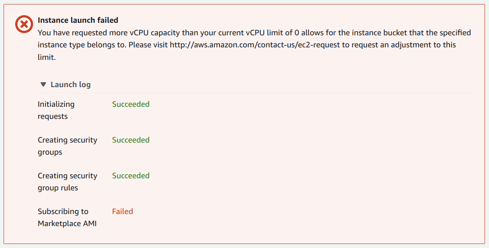
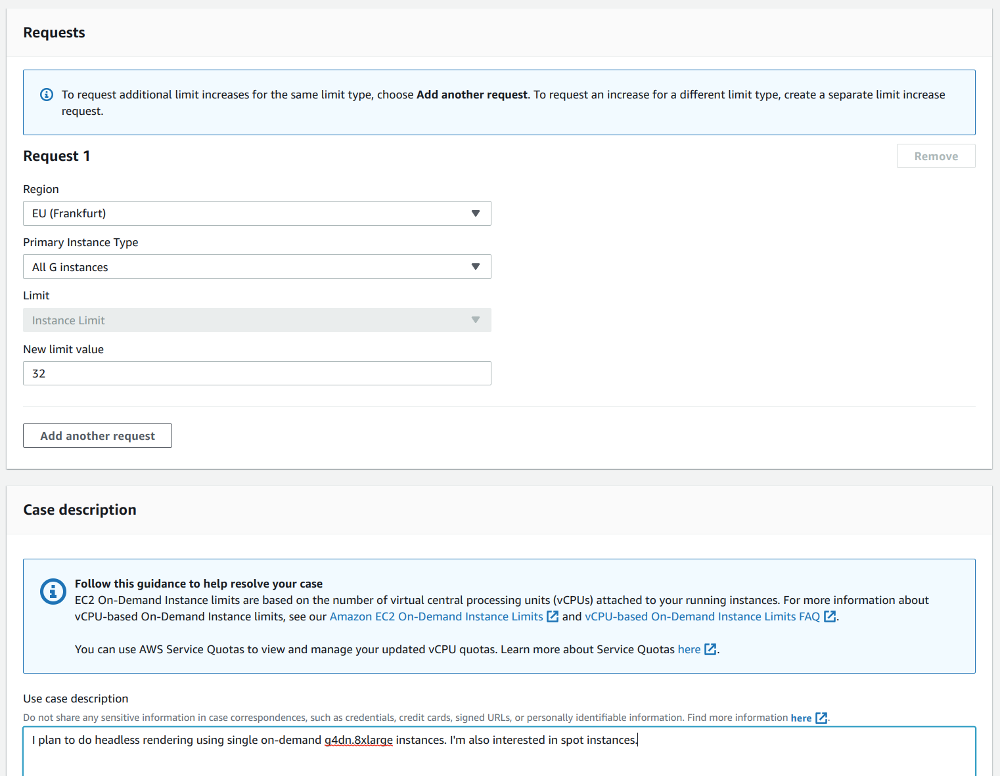

Blender on AWS and Docker
=========================

This page contains my notes on running [Blender](https://www.blender.org/) on AWS and also using Docker. A common pattern is to run work loads, like rendering with Blender, using a Docker running within a EC2 instance - this allows you to decouple the environment used by the workload from that of your EC2 instances. In the end I didn't use Docker and just ran my workloads directly on the EC2 instances.

Running Blender using Docker
----------------------------

Interestingly, the New York Times [R&D department](https://rd.nytimes.com/) maintains the most used Blender docker containers (everything else is abandon-ware). You can find the scripts involved [here](https://github.com/nytimes/rd-blender-docker) on GitHub.

And here e.g. is the [Dockerfile](https://github.com/nytimes/rd-blender-docker/blob/master/dist/3.1-gpu-ubuntu18.04/Dockerfile) for Blender 3.1. They use [nvidia/cudagl](https://hub.docker.com/r/nvidia/cudagl) as the base image - but for some reason use a version that's built on-top of Ubuntu 18.04 rather than the latest 20.04 based image.

Blender on Amazon Linux 2 AMI
-----------------------------

First a brief note on Eevee and then on to Cycles.

### Headless Eevee

Oddly, Eevee can't run without a display (but Cycles can). You can set up a virtual display but it's easier to just use X forwarding when ssh-ing in from a machine that does have X.

X forwarding requires `xauth` (see the answers to this Unix & Linux SE [question](https://unix.stackexchange.com/q/12755/111626)). However, even with X-forwarding Eevee failed like this:

```
$ ./blender/blender -b input.blend -E BLENDER_EEVEE -o //result/ -f 1
Blender 3.1.2 (hash cc66d1020c3b built 2022-03-31 23:36:08)
/run/user/1000/gvfs/ non-existent directory
Read blend: /home/ec2-user/input.blend
Error! GLX_ARB_create_context not available.
```

However, from googling, this may be due to the lack of any kind of local graphics card. For more details, see this [post](https://devtalk.blender.org/t/blender-2-8-unable-to-open-a-display-by-the-rendering-on-the-background-eevee) from 2020 (things don't seem to have changed since).

### Headless Cycles

Running Cycle worked fine without any X-forwarding magic etc. but on a t2.micro instance, it always got killed before completing no matter how few sample were specified:

```
$ ./blender/blender -b input.blend --python-expr 'import bpy ; bpy.data.scenes["Scene"].cycles.samples = 4' -E CYCLES -o //result/ -f 1
```

Note: you can't specify samples via a direct command line argument, hence the small bit of Python above.

Full setup:

```
$ version=3.1.2
$ url=$(curl -s -D- -L https://www.blender.org/download/release/Blender${version%.*}/blender-$version-linux-x64.tar.xz -o /dev/null | sed -n 's/^refresh:.*url=\(.*\.xz\).*/\1/p')
$ curl -sL $url -o blender.tar.xz
$ mkdir blender
$ time tar -xf blender.tar.xz --strip-components=1 -C blender
$ sudo yum -y install libGL
$ sudo yum -y install libXrender
$ sudo yum -y install libXi
$ sudo yum -y install xauth
$ ./blender/blender -b input.blend -E BLENDER_EEVEE -o //result/ -f 1
$ ./blender/blender -b input.blend -E CYCLES -o //result/ -f 1
$ ./blender/blender -b input.blend --python-expr 'import bpy ; bpy.data.scenes["Scene"].cycles.samples = 4' -E CYCLES -o //result/ -f 1
```

`xauth` is only required for Eevee.

Aside: interestingly, if I try locally, I get better performance for `OPTIX` that `OPTIX+CPU`:

```
$ time .../blender -b input.blend --python-expr 'import bpy ; bpy.data.scenes["Scene"].cycles.samples = 16' -E CYCLES -o //result/ -a -- --cycles-device OPTIX
```

_Possibly_, it varies by job.

Note: see [`blender-setup`](blender-setup) for all the `yum` and download steps all rolled into a short bash script.

### Use packed .blend files

Confirm there are no missing file:

```
$ ./blender/blender -b input.blend --python-expr 'import bpy ; bpy.ops.file.report_missing_files()'
...
Warning: Path 'blender-projects/car-texture.png' not found
Warning: Path 'blender-projects/tintin-texture.png' not found
Warning: Path 'blender-projects/car-texture.png' not found
Warning: Path 'blender-projects/tintin-texture.png' not found
...
```

To ensure everything is packed:

```
$ cp race-track.blend render-packed.blend
$ .../blender -b render-packed.blend --python-expr 'import bpy ; bpy.ops.file.pack_all(); bpy.ops.wm.save_mainfile()'
```

GPU instance types
------------------

The suitable instance types for use with "Amazon Linux 2 AMI with NVIDIA TESLA GPU Driver" can be seen on its AWS marketplace [page](https://aws.amazon.com/marketplace/pp/prodview-64e4rx3h733ru).

They recommend the `p3.2xlarge` (at $3 per hour).

The page "[Choosing the right GPU for deep learning on AWS](https://towardsdatascience.com/choosing-the-right-gpu-for-deep-learning-on-aws-d69c157d8c86)" gives a good overview of the different relevant instance types. I chose the `g4dn.xlarge` (at $0.7 per hour) suggested by this page.

You can find more information on AWS's instance type [page](https://www.amazonaws.cn/en/ec2/instance-types/). In the _Accelerated Computing Instances_ section, you've got 3 types - `p3`, `g4dn` and `inf1` - the `inf1` instances use a custom Amazon GPU while `g4dn` and `p3` use Nvidia cards (for more information see [here](https://aws.amazon.com/ec2/instance-types/g4/) for G4 and [here](https://aws.amazon.com/ec2/instance-types/p3/) for P3). The impression, I get is that you should stick with single GPU `g4dn` instances but if you need even more power and multiple GPUs you should switch to `p3`.

Note: the 32vCPU `g4dn.8xlarge` is still single GPU, then prices jump noticeably to the 48 vCPU / 4 GPU `g4dn.12xlarge` and further to the `g4dn.16xlarge` (which is back down to single GPU but has 64 vCPUs).

You can find the price for any instance [here](https://aws.amazon.com/ec2/pricing/on-demand/)

### Stating a GPU instance from the EC2 dashboard

* Name: "Blender server"
* Application and OS Images: I entered "Amazon Linux 2 AMI with NVIDIA TESLA GPU Driver" in the search field and selected the vanilla Amazon version.
* Instance type: g4dn.xlarge
* Key pair: select the previously configured key pair from the dropdown.
* Select _My IP_ from the dropdown to the right of _Allow SSH traffic from_.
* **Important:** I deselected _Allow HTTP traffic from the internet_ which was selected by default.
* Under _Advanced_ I set _Shutdown behavior_ to _Terminate_.

It refused to let me launch such an instance:



You have to go to the [limits calculator](https://eu-central-1.console.aws.amazon.com/ec2/v2/home?region=eu-central-1#LimitsCalculator:) and search for the largest instance, you're likely to want to run, e.g. the `g4dn.8xlarge`. Then click the _Request on-demand limit increase_ link (and/or the spot one):



I requested the limit for a `g4dn.8xlarge` even tho' I only initially planned to use the smaller `g4dn.xlarge`.

However, in the end they would only grant me 8 vCPUs for G4 or P3 instances.

In the end the most powerful machine I could launch, while waiting for a limit increase for G4 and P3 instances, was:

* `c5ad.8xlarge` - compute optimized with 32 vCPUs and 64GiB RAM (using an AMD EPYC 7R32).

Using the `c5ad.8xlarge`, I got render times that were about twice as slow as using my Nvidia RTX 2060 locally.

p3.2xlarge first use
--------------------

Once, I got a quote for G4 and P3 instance, I started a `p3.2xlarge` instance and copied over `.blend` file:

```
    $ scp -i aws-key-pair.pem render-packed.blend ec2-user@18.156.136.92:input.blend
```

Surprisingly, not all the latest security updates were applied:

```
$ sudo yum update
```

Then tried to render a frame using OPTIX:

```
$ version=3.1.2
$ url=$(curl -s -D- -L https://www.blender.org/download/release/Blender${version%.*}/blender-$version-linux-x64.tar.xz -o /dev/null | sed -n 's/^refresh:.*url=\(.*\.xz\).*/\1/p')
$ curl -sL $url -o blender.tar.xz
$ mkdir blender
$ time tar -xf blender.tar.xz --strip-components=1 -C blender
$ time blender/blender -b input.blend --python-expr 'import bpy ; bpy.data.scenes["Scene"].cycles.samples = 16' -E CYCLES -o //result/ -f 1 -- --cycles-device OPTIX
```

It turned out the driver version (450) was too old to support OPTIX.

```
$ nvidia-smi
Sat May  7 10:15:49 2022    
+-----------------------------------------------------------------------------+
| NVIDIA-SMI 450.119.01   Driver Version: 450.119.01   CUDA Version: 11.0     |
|-------------------------------+----------------------+----------------------+
| GPU  Name        Persistence-M| Bus-Id        Disp.A | Volatile Uncorr. ECC |
| Fan  Temp  Perf  Pwr:Usage/Cap|         Memory-Usage | GPU-Util  Compute M. |
|                               |                      |               MIG M. |
|===============================+======================+======================|
|   0  Tesla V100-SXM2...  On   | 00000000:00:1E.0 Off |                    0 |
| N/A   55C    P0    52W / 300W |      0MiB / 16160MiB |      0%      Default |
|                               |                      |                  N/A |
+-------------------------------+----------------------+----------------------+
                                                                            
+-----------------------------------------------------------------------------+
| Processes:                                                                  |
|  GPU   GI   CI        PID   Type   Process name                  GPU Memory |
|        ID   ID                                                   Usage      |
|=============================================================================|
|  No running processes found                                                 |
+-----------------------------------------------------------------------------+
```

It could run with `CUDA` but then the V100 performance was no better than my RTX 2060:

```
$ time blender/blender -b input.blend --python-expr 'import bpy ; bpy.data.scenes["Scene"].cycles.samples = 512' -E CYCLES -o //result/ -a -- --cycles-device CUDA
```

I tried upgrading the driver, but the default repo just contained the 450 version:

```
$ sudo yum erase nvidia cuda
$ yum check-update
Loaded plugins: dkms-build-requires, extras_suggestions, langpacks, priorities, update-motd
[ec2-user@ip-172-31-38-117 ~]$ sudo yum install nvidia cuda
Loaded plugins: dkms-build-requires, extras_suggestions, langpacks, priorities, update-motd
Resolving Dependencies
--> Running transaction check
---> Package cuda.x86_64 0:9.2.88-0.amzn2 will be installed
---> Package nvidia.x86_64 1:450.119.01-0.amzn2 will be installed
...
```

Nvidia drivers
--------------

Nvidia have a detailed [guide to installing CUDA on Linux](https://docs.nvidia.com/cuda/cuda-installation-guide-linux/index.htm).

Note: I don't seem them mentioning `yum install nvidia` - I don't know if this is additional `cuda` or unneeded.

Probably easier to use an Nvidia AMI as Nvidia cover [here](https://docs.nvidia.com/ngc/ngc-deploy-public-cloud/ngc-aws/index.html).

You can also find setup instructions for all major Cloud platforms [here](https://docs.nvidia.com/ngc/ngc-deploy-public-cloud/index.html) in the Nvidia documentation.

Nvidia AMI
----------

The "NVIDIA GPU-Optimized AMI" AWS marketplace [page](https://aws.amazon.com/marketplace/pp/prodview-7ikjtg3um26wq) notes that you have to "rotate the CUDA repo keys":

```
$ sudo apt-key del 7fa2af80
$ wget https://developer.download.nvidia.com/compute/cuda/repos/ubuntu2004/x86_64/cuda-keyring_1.0-1_all.deb
$ sudo dpkg -i cuda-keyring_1.0-1_all.deb
$ sudo apt update
```

The `update` fails as the entry, installed by `cuda-keyring`, clashes with an existing entry. The standard solution is just:

```
$ cd /etc/apt/sources.list.d
$ sudo rm cuda.list
```

The image seems surprisingly stale, so:

```
$ apt update
$ sudo apt update
$ sudo apt full-upgrade
$ sudo apt autoremove 
```

As the update includes a kernal update:

```
$ sudo reboot now
```

On rebooting, check that everything is fine with the Nvidia driver:

```
$ nvidia-smi
Sun May  8 10:01:43 2022       
+-----------------------------------------------------------------------------+
| NVIDIA-SMI 470.103.01   Driver Version: 470.103.01   CUDA Version: 11.4     |
|-------------------------------+----------------------+----------------------+
| GPU  Name        Persistence-M| Bus-Id        Disp.A | Volatile Uncorr. ECC |
| Fan  Temp  Perf  Pwr:Usage/Cap|         Memory-Usage | GPU-Util  Compute M. |
|                               |                      |               MIG M. |
|===============================+======================+======================|
|   0  Tesla V100-SXM2...  On   | 00000000:00:1E.0 Off |                    0 |
| N/A   32C    P0    23W / 300W |      0MiB / 16160MiB |      0%      Default |
|                               |                      |                  N/A |
+-------------------------------+----------------------+----------------------+
                                                                               
+-----------------------------------------------------------------------------+
| Processes:                                                                  |
|  GPU   GI   CI        PID   Type   Process name                  GPU Memory |
|        ID   ID                                                   Usage      |
|=============================================================================|
|  No running processes found                                                 |
+-----------------------------------------------------------------------------+
```

Blender on the Nvidia instance
------------------------------

Unlike the Amazom AMI, it has a high enough driver version for Blender Optix support (see the Blender notes [here](https://docs.blender.org/manual/en/latest/render/cycles/gpu_rendering.html#optix-nvidia)).

Now, Blender could be installed and tried but it failed due to the lack of packages:

```
$ version=3.1.2
$ url=$(curl -s -D- -L https://www.blender.org/download/release/Blender${version%.*}/blender-$version-linux-x64.tar.xz -o /dev/null | sed -n 's/^refresh:.*url=\(.*\.xz\).*/\1/p')
$ curl -sL $url -o blender.tar.xz
$ mkdir blender
$ time tar -xf blender.tar.xz --strip-components=1 -C blender
$ time blender/blender -b input.blend --python-expr 'import bpy ; bpy.data.scenes["Scene"].cycles.samples = 512' -E CYCLES -o //result/ -a -- --cycles-device OPTIX
```

I installed these packages, this seems to be the minimum set:

```
$ sudo apt install libgl-dev
$ sudo apt install libxrender-dev
$ sudo apt install libxi-dev
```

The first frame was quite slow (as expected when loading kernels etc. for the first time) but the second and subsequent ones weren't terribly impressive either:

```
$ time blender/blender -b input.blend --python-expr 'import bpy ; bpy.data.scenes["Scene"].cycles.samples = 512' -E CYCLES -o //result/ -a -- --cycles-device OPTIX
Blender 3.1.2 (hash cc66d1020c3b built 2022-03-31 23:36:08)
ALSA lib confmisc.c:767:(parse_card) cannot find card '0'
...
/run/user/1000/gvfs/ non-existent directory
Read blend: /home/ubuntu/input.blend
...
Fra:1 Mem:152.98M (Peak 410.30M) | Time:00:15.75 | Mem:128.00M, Peak:128.00M | Scene, ViewLayer | Loading render kernels (may take a few minutes the first time)
...
Fra:1 Mem:156.20M (Peak 410.30M) | Time:00:23.67 | Mem:129.58M, Peak:129.58M | Scene, ViewLayer | Updating Geometry BVH Cube.003 2/7 | Building OptiX acceleration structure
...
Fra:1 Mem:156.20M (Peak 410.30M) | Time:00:23.67 | Mem:129.58M, Peak:129.58M | Scene, ViewLayer | Updating Geometry BVH NurbsPath.003 6/7 | Building OptiX acceleration structure
...
Fra:1 Mem:156.31M (Peak 410.30M) | Time:00:23.67 | Mem:129.58M, Peak:129.58M | Scene, ViewLayer | Updating Geometry BVH Plane.001 7/7 | Building OptiX acceleration structure
...
Fra:1 Mem:156.20M (Peak 410.30M) | Time:00:23.68 | Mem:135.13M, Peak:140.94M | Scene, ViewLayer | Updating Scene BVH | Building OptiX acceleration structure
...
Fra:1 Mem:162.47M (Peak 410.30M) | Time:00:23.70 | Mem:141.65M, Peak:141.65M | Scene, ViewLayer | Loading denoising kernels (may take a few minutes the first time)
Fra:1 Mem:172.47M (Peak 410.30M) | Time:00:23.72 | Mem:956.65M, Peak:956.65M | Scene, ViewLayer | Sample 0/512
Fra:1 Mem:322.77M (Peak 410.30M) | Time:00:23.78 | Remaining:00:30.64 | Mem:1106.95M, Peak:1106.95M | Scene, ViewLayer | Sample 1/512
...
Fra:1 Mem:322.77M (Peak 410.30M) | Time:00:46.82 | Remaining:00:00.74 | Mem:1106.95M, Peak:1106.95M | Scene, ViewLayer | Sample 496/512
Fra:1 Mem:386.05M (Peak 480.98M) | Time:00:53.61 | Mem:1106.95M, Peak:1106.95M | Scene, ViewLayer | Sample 512/512
Fra:1 Mem:386.05M (Peak 480.98M) | Time:00:53.61 | Mem:1106.95M, Peak:1106.95M | Scene, ViewLayer | Finished
Saved: '/home/ubuntu/result/0001.png'
 Time: 00:54.36 (Saving: 00:00.64)

...
Fra:2 Mem:386.06M (Peak 480.98M) | Time:00:30.74 | Mem:1106.95M, Peak:1106.95M | Scene, ViewLayer | Finished
Saved: '/home/ubuntu/result/0002.png'
 Time: 00:31.18 (Saving: 00:00.34)
```

The performance using `OPTIX` was actually worse than the performance on the Amazon AMI using `CUDA` where the second frame was rendered in 27s:

```
Fra:2 Mem:390.54M (Peak 485.46M) | Time:00:26.39 | Mem:1103.63M, Peak:1103.63M | Scene, ViewLayer | Sample 512/512
Fra:2 Mem:390.54M (Peak 485.46M) | Time:00:26.39 | Mem:1103.63M, Peak:1103.63M | Scene, ViewLayer | Finished
Saved: '/home/ec2-user/result/0002.png'
 Time: 00:26.85 (Saving: 00:00.35)
```

For reference, here's the output for `lscpu` for the Nvidia AMI. I wonder if the same mitigations are enabled/disabled for the Amazon AMI:

```
$ lscpu
Architecture:                    x86_64
CPU op-mode(s):                  32-bit, 64-bit
Byte Order:                      Little Endian
Address sizes:                   46 bits physical, 48 bits virtual
CPU(s):                          8
On-line CPU(s) list:             0-7
Thread(s) per core:              2
Core(s) per socket:              4
Socket(s):                       1
NUMA node(s):                    1
Vendor ID:                       GenuineIntel
CPU family:                      6
Model:                           79
Model name:                      Intel(R) Xeon(R) CPU E5-2686 v4 @ 2.30GHz
Stepping:                        1
CPU MHz:                         3000.000
CPU max MHz:                     3000.0000
CPU min MHz:                     1200.0000
BogoMIPS:                        4600.02
Hypervisor vendor:               Xen
Virtualization type:             full
L1d cache:                       128 KiB
L1i cache:                       128 KiB
L2 cache:                        1 MiB
L3 cache:                        45 MiB
NUMA node0 CPU(s):               0-7
Vulnerability Itlb multihit:     KVM: Mitigation: VMX unsupported
Vulnerability L1tf:              Mitigation; PTE Inversion
Vulnerability Mds:               Vulnerable: Clear CPU buffers attempted, no microcode; SMT Host state unknown
Vulnerability Meltdown:          Mitigation; PTI
Vulnerability Spec store bypass: Vulnerable
Vulnerability Spectre v1:        Mitigation; usercopy/swapgs barriers and __user pointer sanitization
Vulnerability Spectre v2:        Mitigation; Retpolines, STIBP disabled, RSB filling
Vulnerability Srbds:             Not affected
Vulnerability Tsx async abort:   Vulnerable: Clear CPU buffers attempted, no microcode; SMT Host state unknown
Flags:                           fpu vme de pse tsc msr pae mce cx8 apic sep mtrr pge mca cmov pat pse36 clflush mmx fxsr sse sse2 ht syscall nx pdpe1gb rdtscp lm constant_tsc rep_good nopl xtopology nonstop_tsc cpuid aperfmperf tsc_known_freq pni pclmulqdq ssse3 fma cx16 pcid sse4_1 sse4_2 x2apic movbe popcnt tsc_deadline_timer aes xsave 
                                 avx f16c rdrand hypervisor lahf_lm abm 3dnowprefetch cpuid_fault invpcid_single pti fsgsbase bmi1 hle avx2 smep bmi2 erms invpcid rtm rdseed adx xsaveopt
```

So it seems a V100 isn't any real improvement on an RTX 2060. It's hard to find benchmarks for the V100 but this actually seems about right.
