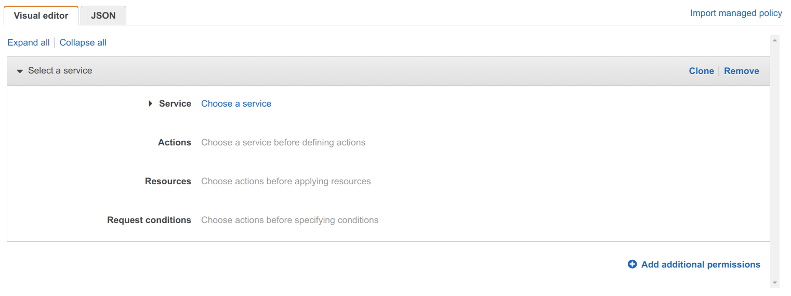

AWS notes
=========

This page contains more miscellaneous notes made after I'd become somewhat familiar with AWS.

Get the latest version of an AMI
--------------------------------

Given an image name, with any version information replaced with a `*` (wildcard), you can find the latest version of the image like so:

```
$ aws ec2 describe-images --owners aws-marketplace --filter 'Name=name,Values=amzn2-ami-graphics-hvm-*' --query 'sort_by(Images, &CreationDate)[-1].Name' --output text
amzn2-ami-graphics-hvm-2.0.20220606.1-x86_64-gp2-e6724620-3ffb-4cc9-9690-c310d8e794ef-ami-0d1bc825c14cd6b9c.4
```


Metadata
--------

On an EC2 instance, you can get your region like so:

```
$ curl http://instance-data/latest/meta-data/placement/availability-zone/
```

For all the other metadata, you can retrieve, see:

```
$ curl http://instance-data/latest/meta-data
```

On non-Amazon AMIs (that don't use the Amazon DNS service), you have to use `169.254.169.254` rather than `instance-data` as the host.

You can also use the command `ec2-metadata`:

```
$ ec2-metadata
ami-id: ami-09439f09c55136ecf
...
$ ec2-metadata --help
...
```

You should also be able to do:

```
$ cloud-init query --all
```

However, Amazon use an old version of `cloud-init` that will only work if run as root.

But you can find the JSON data it would query in `/run/cloud-init/instance-data.json`

User-data handling
------------------

If your user-data file is a sequence of bash commands then you have to include a shebang at the top, or you'll get a rather unclear cloud-init error like this in `/var/log/cloud-init-output.log`:

```
Jun 11 11:21:12 cloud-init[2401]: __init__.py[WARNING]: Unhandled non-multipart (text/x-not-multipart) userdata: 'aws s3 cp s3://render-jo...'
```

Note: `aws s3 cp s3://render-jo...'` was part of the first line of my user-data script.

Without a shebang, cloud-init defaults to assuming the user-data is a multipart archive (see the [documentation](https://cloudinit.readthedocs.io/en/latest/topics/format.html#user-data-script)).

S3 access on an EC2 instance using roles
----------------------------------------

If you've ssh-ed to one of your EC2 instances and try `ls` on one of your buckets, it'll fail:

```
$ aws s3 ls s3://d9983d65-b1bd-4bcd-a442-aae6c9b0d607
Unable to locate credentials. You can configure credentials by running "aws configure".
```

Any attempt to access S3 (or any other AWS service) using boto3 will also fail in a similar fashion.

But rather than uploading your credentials (which you should be keeping extra safe), you can do things as described by StormWind Studios in their YouTube tutorial ["Using AWS Roles for EC2 S3 Access"](https://www.youtube.com/watch?v=0zq9eC1M5Dk). Here's my take on it...

In the AWS web interface, go to _IAM / Roles_. Click the _Create Role_ button, select _EC2_ under _Common use cases_ and click _Next_.

Click _Create Policy_, in the end it does seem easier to use the _JSON_ tab rather than the _Visual Editor_ tab. But let's give it a try.



First, choose the service we're focusing on - S3. Then in _Actions_, expand _List_ and tick _ListBucket_.

Initially, the _Manual actions_ section is a bit confusing - click _add actions_ there and enter:


This is a quick alternative to going through the _Read_, _Write_ etc. sections and ticking all the actions ending with "Object" - these are the ones you need if you want to read, write and delete objects.

Then got to the _Resources_ section and tick _All resources_ to stop it complaining that you have to specify ARNs for some of the actions you selected.

Now, jump to the _JSON_ tab and you'll see this translates to just:

```json
{
    "Version": "2012-10-17",
    "Statement": [
        {
            "Sid": "VisualEditor0",
            "Effect": "Allow",
            "Action": [
                "s3:*Object",
                "s3:ListBucket"
            ],
            "Resource": "*"
        }
    ]
}
```

`"Sid"` is the statement ID - you could put whatever you want there (it just has to uniquely identify the given statement within the list of 1 or more statements).

Note: the above isn't far off from the already available _AmazonS3FullAccess_ policy.

You could split things out and specify specific resources:

```json
{
    "Version": "2012-10-17",
    "Statement": [
        {
            "Sid": "ListObjectsInBucket",
            "Effect": "Allow",
            "Action": ["s3:ListBucket"],
            "Resource": ["arn:aws:s3:::bucket-name"]
        },
        {
            "Sid": "AllObjectActions",
            "Effect": "Allow",
            "Action": "s3:*Object",
            "Resource": ["arn:aws:s3:::bucket-name/*"]
        }
    ]
}
```

Note the wildcard in the second `"Resource"` value. This example is from [here](https://docs.aws.amazon.com/IAM/latest/UserGuide/reference_policies_examples_s3_rw-bucket.html) in the AWS IAM documentation.

OK - now we have the policy details, click _Next_, skip over _Tags_ and on the _Review_ page just enter a name like "S3ReadWriteAccessPolicy".

Now, return to the _Roles_ browser tab (you we're in the _Add permissions_ section) where you were before pressing _Create Policy_.

In the _Permission policies_ section, tick the policy that you just created and click _Next_.

Just enter a _Role Name_, like "S3ReadWriteAccessRole", and click _Create Role_.

### Assigning the role to an existing EC2 instance

Now, back to the _EC2 / Instances_ console. Oddly, after all the roles stuff, the region confusingly defaults to something other than my eu-central-1 zone and no instances are shown.

Once you've switched region if necessary, tick your instance, go to _Actions / Security / Modify IAM role_, select the newly created role and click _Update IAM role_.

### Creating roles using the CLI

See my notes [here](https://github.com/george-hawkins/boto3-renderer/blob/master/docs/create-role.md) on working with roles using the CLI.

Spot pricing
------------

It doesn't seem to be possible to ask "what price am I paying for my currently running spot instances?" Instead, you have to look up the current spot price for the relevant availability zones.

You can do this like so:

```
$ aws ec2 describe-spot-price-history --start-time=$(date +%s) --product-descriptions='Linux/UNIX' --instance-types g4dn.xlarge
{
    "SpotPriceHistory": [
        {
            "AvailabilityZone": "eu-central-1c",
            "InstanceType": "g4dn.xlarge",
            "ProductDescription": "Linux/UNIX",
            "SpotPrice": "0.197400",
            "Timestamp": "2022-06-10T21:56:38+00:00"
        },
        {
            "AvailabilityZone": "eu-central-1b",
            "InstanceType": "g4dn.xlarge",
            "ProductDescription": "Linux/UNIX",
            "SpotPrice": "0.197400",
            "Timestamp": "2022-06-10T19:46:42+00:00"
        },
        {
            "AvailabilityZone": "eu-central-1a",
            "InstanceType": "g4dn.xlarge",
            "ProductDescription": "Linux/UNIX",
            "SpotPrice": "0.197400",
            "Timestamp": "2022-06-10T19:46:42+00:00"
        }
    ]
}
```

You seem to just get the most recent price change, e.g. the above command was run more than 12 hours after the UTC values shown in the `Timestamp` fields. A price seems to be published at least once a day even if the price hasn't changed since the previous day.

I'm surprised how little price variance there is for these spot instances. If you run the following command, you get the last two months of price updates:

```
$ aws ec2 describe-spot-price-history --product-descriptions='Linux/UNIX' --instance-types g4dn.xlarge
```

You can see the price is very consistently $0.1974, which was exactly 30% of the on-demand price of $0.658. Perhaps 30% is a lower-bound that AWS sets on spot prices, it never dips below this. And it only occasionally rises above this and only on one of the three availability zones - `eu-central-1c` - for my region. I don't know if this reflects how AWS manages things when they finally do reach capacity across zones and that, however things are managed, the situation never arose that they started feeling enough capacity pressure that things spilled over into the `1a` and `1b` zones - but it is odd to see the `1a` and `1b` prices staying at $0.1974 while seeing them rise steeply in just `1c` (occasionally, to very near the on-demand price).

Writing log events from the CLI on an EC2 instance
--------------------------------------------------

The `aws` command on Amazon Linux 2 EC2 instances is actually v1 and doesn't support some log related operations.

Install AWS CLI v2 (yes, there really doesn't seem to be a `yum` package):

```
$ curl https://awscli.amazonaws.com/awscli-exe-linux-x86_64.zip -o awscliv2.zip
$ unzip awscliv2.zip
$ sudo ./aws/install
```

It's installed to `/usr/local/bin`, so:

```
$ PATH=/usr/local/bin:$PATH
```

Listen for log events:

```
$ /usr/local/bin/aws logs tail <log-group-name> --follow
```

To create log events - first, create a stream (for the existing group):

```
$ /usr/local/bin/aws logs create-log-stream --log-group-name <log-group-name> --log-stream-name foobar
```

Create an `events.json`:

```
$ cat > events.json << 'EOF'
[
  {
    "timestamp": 1654437914755,
    "message": "Example Event 1"
  },
  {
    "timestamp": 1654437914756,
    "message": "Example Event 2"
  },
  {
    "timestamp": 1654437914757,
    "message": "Example Event 3"
  }
]
```

Update the `timestamp` values with values generated using:

```
$ date +%s%3N
```

And then write them out like so:

```
$ aws logs put-log-events --log-group-name render-job-log-group-d1f294c6-1c17-430d-82b5-bc8136f84b71 --log-stream-name foobar --log-events file://events.json
```

To put further events, you have to use the `sequence-token` returned by the first `put-log-events`:

```
$ aws logs put-log-events --log-group-name render-job-log-group-d1f294c6-1c17-430d-82b5-bc8136f84b71 --log-stream-name foobar --log-events file://events.json --sequence-token 49620733793119385444699042086678722610600419464713621746
```

Power-off
---------

The most aggressive power-off seems to be:

```
$ sudo poweroff --no-wtmp --no-wall --force --force
```

Specifying `--force` twice "results in an immediate shutdown without contacting the system manager."

Note: this seems a bit to brutal as it doesn't give `ssh` a chance to properly disconnect you.

For a proper disconnect:

```
$ sudo poweroff --no-wtmp --no-wall
```

